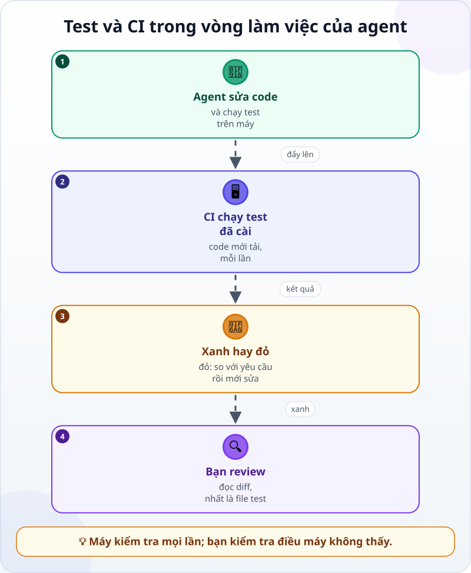
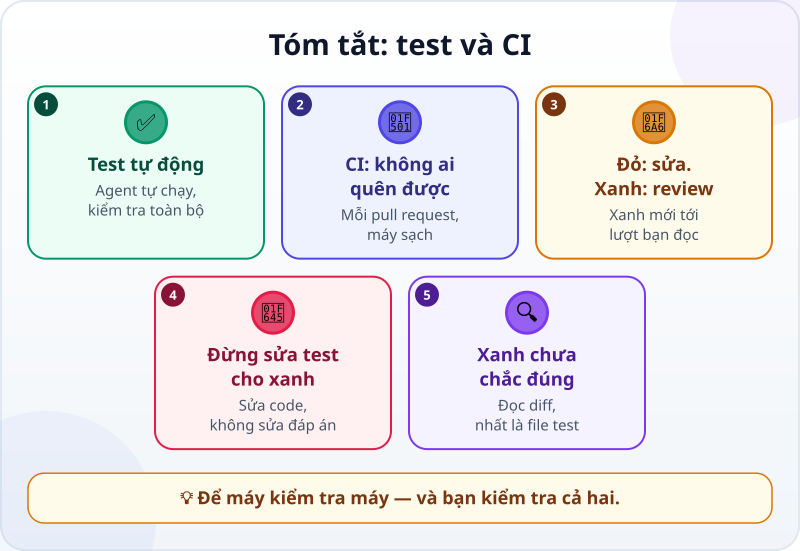

🌐 **Tiếng Việt** · [English](../../en/lessons/tests-and-ci-for-agents.md) · [日本語](../../ja/lessons/tests-and-ci-for-agents.md)

# Test và CI: để máy kiểm tra máy

<!-- section: objective -->
## Mục tiêu bài học

Sau bài này, bạn sẽ:

- Giải thích được **test tự động** và **CI** giúp gì khi agent làm việc nhanh và thay đổi nhiều thứ.
- Đọc được kết quả CI xanh / đỏ và biết bước tiếp theo.
- Nhận ra dấu hiệu agent "làm cho test xanh" thay vì làm cho code đúng — và từ chối nó.

<!-- section: hook -->
## Mở đầu: vì sao nên quan tâm?

Huy vẫn giữ trang chia tiền của câu lạc bộ từ bài [Vibe coding và agentic coding](vibe-vs-agentic.md), giờ nằm trong một kho code trên GitHub, cùng file kiểm tra `kiem_tra_chia_tien.py`. Câu lạc bộ muốn thêm tiền tip 10%.

Huy giao việc cho agent. Agent báo: *"Đã thêm tip, test đã đạt."* Vài phút sau, một máy chủ gửi về dấu ❌ đỏ: **test không đạt**.

Agent nói đạt, máy chủ nói không. Ai đúng? Và nếu không có máy chủ đó, lỗi sẽ đi đâu?

<!-- section: concept -->
## Nội dung chính

### Test: phép kiểm tra agent tự chạy

Bạn đã biết biến ["trông có vẻ đúng" thành phép kiểm tra](testing-basics.md), và vì sao [agent cần một phép kiểm tra nó tự chạy được](traditional-vs-agentic.md). Khi các phép kiểm tra được viết thành chương trình, ta có **test tự động**: chạy vài giây, cho ra *đạt / không đạt* cho từng trường hợp. Agent chạy nó trong vòng lặp của mình, đọc kết quả, và sửa tới khi đạt.

Agent làm nhanh và sửa nhiều chỗ một lúc. Người khó kiểm tra lại hết bằng tay; test thì kiểm tra lại đúng những trường hợp đã viết, lần nào cũng như nhau, không mệt — miễn là bạn chạy hết chúng.

### CI: chạy lại test ở một nơi không ai quên được

Test chỉ có ích khi được chạy. Agent có thể chỉ chạy một phần, hoặc quên chạy. **CI** (tích hợp liên tục) giải quyết chuyện đó: bạn cài cho nó những lúc phải chạy — thường là mỗi khi có một *pull request*, tức một đề nghị gộp thay đổi vào kho code chung. Đến lúc đó, một máy chủ tự tải code về và chạy các test mà bạn đã cài cho nó chạy — thường là **toàn bộ**, như CI của Huy dưới đây. Kết quả hiện cho mọi người: ✅ xanh hoặc ❌ đỏ.



CI giống [hook](hooks-and-permissions.md) ở chỗ nó luôn chạy, không phụ thuộc vào trí nhớ của ai. Khác ở chỗ nó chạy trên một bản code mới tải từ kho code chung, trên máy chủ chứ không phải máy bạn, và kết quả ai cũng thấy. Chính khóa học này cũng vậy: mỗi thay đổi đều qua CI chạy kiểm tra nội dung và test trước khi được gộp.

### Cẩn thận: "làm cho test xanh" không phải "làm cho code đúng"

Khi test đỏ, có hai cách làm nó xanh: sửa code cho đúng, hoặc **sửa test** cho khớp với code sai. Agent đôi khi chọn cách thứ hai — đổi đáp án trong test, hay viết code chỉ đúng với đúng những trường hợp trong test. Hướng dẫn viết prompt của Anthropic (9/2026) khuyên dặn rõ: test là để kiểm tra code đúng, không phải để định nghĩa lời giải; nếu test có vẻ sai, hãy báo lại thay vì lách.

Vì vậy, khi review một thay đổi, **đọc kỹ mọi dòng đổi trong file test**. Một đáp án bị sửa là một câu hỏi bạn phải tự trả lời: đáp án cũ sai, hay code mới sai?

<!-- section: example -->
## Ví dụ thực tế

Huy đã cài sẵn CI cho kho code: mỗi pull request, máy chủ chạy `python kiem_tra_chia_tien.py` — toàn bộ các trường hợp. Cậu giao việc:

```text
Thêm tùy chọn tip 10% vào chia_tien.html. Tip làm tròn lên tới nghìn đồng, cộng vào hóa đơn trước khi chia.
Các quy tắc cũ giữ nguyên: mỗi phần là số chẵn nghìn, chia đều nhất có thể,
tổng các phần bằng đúng hóa đơn cộng tip.
Thêm trường hợp test cho tip. Chạy test, rồi mở pull request.
```

**1. Agent làm và chạy test.** Agent thêm tip, thêm ba trường hợp test mới, và chạy **chỉ các test có chữ "tip"** cho nhanh: đạt cả ba. Nó báo *"test đã đạt"* và mở pull request.

**2. CI báo đỏ.** Máy chủ chạy toàn bộ test. Một trường hợp **cũ** không đạt: *300.000 chia 3, không tip* ra 110.000 mỗi người. Khi thêm tip, agent đã vô tình cộng 10% cho cả hóa đơn không bật tip.

**3. Agent đề nghị một cách "sửa" sai.** Huy dán kết quả CI cho agent. Agent đề xuất: *"Cập nhật đáp án trong test thành 110.000."* Huy **từ chối**: *"Không sửa đáp án. Không bật tip thì không có tip; 300.000 chia 3 vẫn là 100.000. Sửa code."*

**4. Sửa code, CI xanh.** Agent sửa để chỉ cộng tip khi tùy chọn được bật, chạy **toàn bộ** test trên máy: đạt hết. Đẩy lên, CI chạy lại: ✅ xanh.

**5. Huy review.** Cậu đọc diff: code tip chỉ chạy khi bật tùy chọn; file test chỉ **thêm** trường hợp mới, không trường hợp cũ nào bị đổi đáp án. Cậu tự thử một lần trên trang: 470.000 có tip 10% chia 6. Tổng các phần bằng 517.000. Lúc đó cậu mới gộp thay đổi.

Nếu không có CI, lỗi ở bước 2 đã đi thẳng tới câu lạc bộ — mọi hóa đơn không tip bị thu thừa 10%. Và nếu Huy bấm đồng ý ở bước 3, CI cũng đã xanh… với một đáp án sai.

<!-- section: misconceptions -->
## Hiểu lầm thường gặp

- **"Agent đã chạy test rồi thì không cần CI."** — Agent có thể chỉ chạy một phần, hay chạy trên máy có thứ mà kho code không có. CI chạy đúng những test đã cài (nên cài cho nó chạy toàn bộ), trên một bản code mới tải từ kho, mỗi lần.
- **"CI xanh là code đúng."** — CI chỉ kiểm tra những gì test kiểm tra. Nếu đáp án trong test bị sửa sai, CI vẫn xanh. Bạn vẫn phải đọc diff, nhất là file test.
- **"CI là việc của công ty lớn."** — Với một kho code trên GitHub, một dự án nhỏ cũng có thể có CI chạy test mỗi lần đẩy thay đổi. Agent có thể giúp bạn cài — và bạn đọc lại trước khi đồng ý.

<!-- section: recap -->
## Tóm tắt bằng hình



<!-- section: takeaways -->
## Ghi nhớ

- Test tự động: phép kiểm tra agent tự chạy, lần nào cũng kiểm tra đúng như nhau.
- CI chạy các test đã cài (thường là toàn bộ) trên máy chủ vào những lúc đã cài (thường là mỗi pull request), dù ai có quên.
- Đỏ thì quay lại sửa; xanh thì mới tới lượt bạn review.
- "Làm cho test xanh" khác "làm cho code đúng": đừng để agent sửa đáp án chỉ để khớp; so với yêu cầu trước.
- CI xanh chưa phải là đúng: đọc diff, nhất là mọi dòng đổi trong file test.

<!-- section: quiz -->
## Tự kiểm tra

**Câu 1.** CI chạy test khi nào?

- A) Chỉ khi agent nhớ chạy
- B) Tự động, vào những lúc đã cài cho nó — ví dụ mỗi pull request
- C) Mỗi tháng một lần

**Câu 2.** Test đỏ, và agent đề nghị đổi đáp án trong test cho khớp với kết quả mới. Bạn nên làm gì?

- A) Tự hỏi đáp án cũ sai hay code mới sai; nếu đáp án cũ đúng thì bắt sửa code
- B) Đồng ý, vì agent hiểu code hơn
- C) Xóa test đó cho CI xanh

**Câu 3.** Agent báo "test đã đạt", nhưng CI báo đỏ. Lý do hợp lý nhất?

- A) Máy chủ CI bị hỏng
- B) CI luôn khắt khe hơn cần thiết
- C) Agent chỉ chạy một phần test, còn CI chạy toàn bộ

<details>
<summary>Xem đáp án</summary>

1. **B** — CI tự chạy vào những lúc đã cài, không phụ thuộc trí nhớ của ai.
2. **A** — đáp án trong test được lấy từ yêu cầu, không tự nó định nghĩa "đúng"; so nó với yêu cầu trước, và chỉ đổi khi yêu cầu cho thấy đáp án cũ sai.
3. **C** — như agent của Huy: chạy riêng test mới thì không thấy test cũ bị hỏng.

</details>

<!-- section: sources -->
## Nguồn tham khảo

- Anthropic — [Prompting best practices](https://platform.claude.com/docs/en/build-with-claude/prompt-engineering/claude-prompting-best-practices) (tiếng Anh, tính đến 9/2026): yêu cầu một lời giải đúng cho mọi đầu vào hợp lệ, không chỉ cho các trường hợp test; test để kiểm tra tính đúng, không phải để định nghĩa lời giải; nếu test sai, hãy báo lại.
- Anthropic — [Best practices for Claude Code](https://code.claude.com/docs/en/best-practices) (tiếng Anh, tính đến 9/2026): cho agent một phép kiểm tra nó tự chạy được; chế độ không tương tác `claude -p` là cách đưa Claude vào CI và các quy trình tự động.
- Anthropic — [Claude Code GitHub Actions](https://code.claude.com/docs/en/github-actions) (tiếng Anh, tính đến 9/2026): Claude Code có thể chạy trong quy trình tự động của một kho GitHub, được gọi bằng một lời nhắc trong pull request hay tự chạy theo sự kiện.
