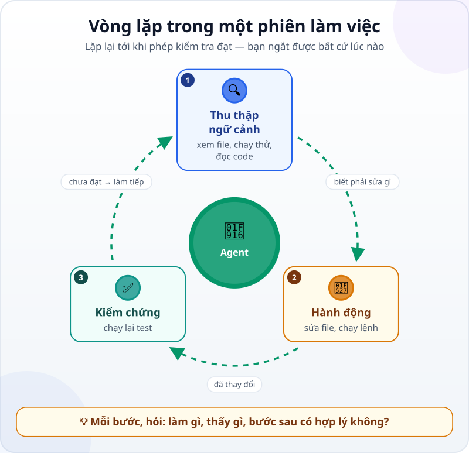

🌐 **Tiếng Việt** · [English](../../en/lessons/the-agent-loop.md) · [日本語](../../ja/lessons/the-agent-loop.md)

# Lần theo vòng lặp của agent qua một phiên làm việc thật

<!-- section: objective -->
## Mục tiêu bài học

Sau bài này, bạn sẽ:

- Gọi tên ba giai đoạn của **vòng lặp agent (agent loop)** — thu thập ngữ cảnh, hành động, kiểm chứng — trong một phiên thật.
- Đọc nhật ký một phiên làm việc bằng ba câu hỏi cho mỗi bước.
- Biết lúc nào nên dừng hay chỉnh hướng agent, và vì sao vẫn tự kiểm tra kết quả cuối.

<!-- section: hook -->
## Mở đầu: vì sao nên quan tâm?

Tuấn là kỹ sư cơ khí làm việc ở Nhật. Anh nhờ agent sửa một lỗi trong đoạn code tính tổng chi phí mà cả nhóm dùng. Vài giây sau, agent báo: *"Đã sửa xong, tất cả test đều đạt."* Trên màn hình còn một dãy dài những dòng lệnh và kết quả mà Tuấn lướt qua mà không đọc.

Anh có nên tin câu "đã sửa xong" không? Dãy dòng đó chính là nhật ký của phiên làm việc — và đọc được nó là kỹ năng giúp bạn giám sát agent, thay vì chỉ tin lời báo cáo.

<!-- section: concept -->
## Nội dung chính

### Ba giai đoạn của một phiên

Trong bài [Bộ não, đôi tay và vòng lặp](agent-parts-and-loop.md), bạn đã biết agent lặp lại: suy nghĩ, dùng công cụ, quan sát kết quả. Tài liệu Claude Code (9/2026) chia công việc của một phiên thành ba giai đoạn đan xen nhau:

1. **Thu thập ngữ cảnh:** xem có những file nào, chạy thử, đọc code.
2. **Hành động:** sửa file, tạo file, chạy lệnh làm thay đổi thứ gì đó.
3. **Kiểm chứng:** chạy lại test hay phép kiểm tra để xem thay đổi có đạt không.

Nếu chưa đạt, vòng lặp quay lại. Mỗi lần agent dùng một công cụ, kết quả được đưa trở lại cuộc trò chuyện, như bạn đã thấy trong [Gọi công cụ](tool-calling.md), và agent dựa vào đó để chọn bước tiếp theo.



### Ba câu hỏi cho mỗi bước

Đọc nhật ký phiên không cần hiểu hết code. Với mỗi bước, chỉ cần hỏi:

1. **Agent vừa làm gì?** — dùng công cụ nào, với cái gì.
2. **Nó thấy gì?** — kết quả trả về.
3. **Bước tiếp theo có hợp lý với điều nó vừa thấy không?**

Nếu câu 3 trả lời "không" — agent đi sửa một file chẳng liên quan, hay sửa bài test cho nó đạt thay vì sửa code — đó là lúc can thiệp.

### Bạn cũng ở trong vòng lặp

Theo tài liệu Claude Code (9/2026), bạn có thể ngắt agent bất cứ lúc nào: nhấn `Esc` để dừng ngay, hoặc gõ một lời chỉnh hướng và nhấn Enter. Agent làm việc tự chủ, nhưng vẫn nghe bạn.

<!-- section: example -->
## Ví dụ thực tế

Dưới đây là một phiên **thật**, do Claude Code chạy khi soạn bài này (9/2026), chỉ rút gọn phần hiển thị. Thư mục `ai-practice` có hai file: `expenses.py` với hàm `total` tính tổng một danh sách số tiền, và `test_expenses.py` với hai bài test. Mục tiêu giao cho agent: *"Chạy test; nếu có test sai, tìm nguyên nhân và sửa code, không sửa test. Chạy lại tới khi đạt."*

**Bước 1 — Thu thập ngữ cảnh: xem thư mục.**

```text
$ ls
expenses.py
test_expenses.py
```

Agent thấy hai file. Hợp lý: bước tiếp theo là chạy test để biết đang sai gì.

**Bước 2 — Thu thập ngữ cảnh: chạy test.**

```text
$ python -m pytest -q
E       assert 205000 == 250000
E        +  where 205000 = total([85000, 120000, 45000])
FAILED test_expenses.py::test_total - assert 205000 == 250000
1 failed, 1 passed
```

Agent thấy: một test sai. Tổng đúng phải là 250.000, nhưng hàm trả về 205.000 — đúng bằng 85.000 + 120.000, tức là **thiếu khoản cuối** 45.000. Hợp lý: đọc code để tìm vì sao.

**Bước 3 — Thu thập ngữ cảnh: đọc code.**

```text
$ cat expenses.py
def total(amounts):
    """Return the sum of a list of amounts."""
    result = 0
    for i in range(len(amounts) - 1):
        result += amounts[i]
    return result
```

Agent thấy: vòng lặp chạy `range(len(amounts) - 1)` — dừng trước phần tử cuối. Khớp với điều thấy ở bước 2.

**Bước 4 — Hành động: sửa đúng một dòng.**

```text
-    for i in range(len(amounts) - 1):
+    for i in range(len(amounts)):
```

Agent sửa code, không đụng vào bài test — đúng yêu cầu.

**Bước 5 — Kiểm chứng: chạy lại test.**

```text
$ python -m pytest -q
2 passed
```

Phép kiểm tra đạt, vòng lặp dừng, agent báo cáo.

**Một chi tiết đáng chú ý.** Ở bước 2, bài test thứ hai (`test_empty`: tổng của danh sách rỗng là 0) **đã đạt ngay cả khi code còn lỗi**. Một bài test đạt, đứng một mình, chưa chứng minh code đúng; nó chỉ chứng minh đúng điều nó kiểm tra. Đây là lý do nên có vài bài test khác nhau, như trong [Từ "trông có vẻ đúng" đến phép kiểm tra](testing-basics.md).

**Phần của bạn.** Đọc năm bước trên mất chưa tới một phút. Tuấn còn làm thêm hai việc: xem thay đổi (một dòng, đúng chỗ) và tự chạy lại test trên máy mình. Lúc đó "đã sửa xong" mới là điều anh đã kiểm tra, không chỉ là điều anh được nghe.

<!-- section: try-it -->
## Thử ngay

Khoảng 5 phút, trong `ai-practice`, với một agent được phép chạy lệnh trên máy cá nhân. Máy công ty: chỉ làm khi công ty cho phép; không được thì đọc phiên ở trên và tự trả lời ba câu hỏi cho từng bước.

1. Nhờ agent tạo hai file đúng như sau:

   ```python
   # expenses.py
   def total(amounts):
       """Return the sum of a list of amounts."""
       result = 0
       for i in range(len(amounts) - 1):
           result += amounts[i]
       return result
   ```

   ```python
   # test_expenses.py
   from expenses import total

   def test_total():
       assert total([85000, 120000, 45000]) == 250000

   def test_empty():
       assert total([]) == 0

   if __name__ == "__main__":
       test_total()
       test_empty()
       print("All tests passed")
   ```

2. Giao mục tiêu: *"Chạy `python test_expenses.py`; nếu có test sai, tìm nguyên nhân và sửa code, không sửa test. Chạy lại tới khi đạt."* Nếu agent muốn cài thêm gì, đó là việc ✋ phải hỏi trước.
3. Trong lúc agent làm, ghi cạnh mỗi bước một chữ: **N** (thu thập ngữ cảnh), **H** (hành động) hoặc **K** (kiểm chứng).
4. Tự kiểm tra: mở `test_expenses.py` xem nó còn nguyên không, rồi tự chạy `python test_expenses.py` — phải in ra `All tests passed`.

- *Tôi cho xem được…* nhật ký phiên với chữ N/H/K cạnh từng bước.
- *Tôi đã kiểm tra…* file test không bị sửa, và tự chạy lại test thấy đạt.
- *Tôi sẽ không dùng cách này khi…* ví dụ: chưa có bài test nào — khi đó agent không có gì để kiểm chứng.

<!-- section: misconceptions -->
## Hiểu lầm thường gặp

- **"Agent báo test đạt là xong."** — Hãy xem nó đã sửa gì: một agent có thể làm test đạt bằng cách sửa chính bài test. Và tự chạy lại một lần.
- **"Muốn đọc nhật ký phiên phải biết lập trình."** — Ba câu hỏi — làm gì, thấy gì, bước sau có hợp lý không — đủ để phát hiện phần lớn chỗ đáng ngờ.
- **"Agent đã chạy thì mình không chen vào được."** — Bạn có thể dừng hay chỉnh hướng bất cứ lúc nào; ngắt sớm tốt hơn sửa hậu quả muộn.

<!-- section: recap -->
## Tóm tắt bằng hình


<!-- section: takeaways -->
## Ghi nhớ

- Một phiên là vòng lặp: thu thập ngữ cảnh, hành động, kiểm chứng — tới khi phép kiểm tra đạt.
- Kết quả của mỗi công cụ quay về cuộc trò chuyện và quyết định bước tiếp theo.
- Đọc từng bước bằng ba câu: làm gì, thấy gì, bước sau có hợp lý không.
- Một bài test đạt chưa chứng minh code đúng; nó chỉ chứng minh điều nó kiểm tra.
- Bạn có thể ngắt bất cứ lúc nào, và vẫn tự kiểm tra kết quả cuối.

<!-- section: quiz -->
## Tự kiểm tra

**Câu 1.** Trong phiên ở trên, bước "chạy lại test sau khi sửa" thuộc giai đoạn nào?

- A) Thu thập ngữ cảnh
- B) Kiểm chứng
- C) Hành động

**Câu 2.** Đọc nhật ký, bạn thấy agent sửa file `test_expenses.py` để bài test đạt. Bạn nên làm gì?

- A) Dừng agent lại và nhắc: sửa code, không sửa test
- B) Để nó làm tiếp, vì cuối cùng test cũng đạt
- C) Xóa cả thư mục và làm lại từ đầu

**Câu 3.** Vì sao `test_empty` đạt ngay cả khi code còn lỗi?

- A) Vì pytest bỏ qua bài test đó
- B) Vì agent đã sửa nó từ trước
- C) Vì với danh sách rỗng, vòng lặp sai hay đúng đều cho tổng 0 — bài test đó không chạm tới lỗi

<details>
<summary>Xem đáp án</summary>

1. **B** — chạy lại phép kiểm tra để xem thay đổi có đạt không là kiểm chứng.
2. **A** — bước đó không hợp lý với mục tiêu; ngắt và chỉnh hướng ngay. Xóa cả thư mục là quá tay.
3. **C** — một bài test chỉ chứng minh đúng điều nó kiểm tra; cần những bài test chạm tới chỗ có thể sai.

</details>

<!-- section: sources -->
## Nguồn tham khảo

- Anthropic — [How Claude Code works](https://code.claude.com/docs/en/how-claude-code-works) (tiếng Anh, tính đến 9/2026): khi nhận việc, Claude làm qua ba giai đoạn đan xen — thu thập ngữ cảnh, hành động, kiểm chứng kết quả — và lặp lại tới khi xong; mỗi lần dùng công cụ, kết quả quay về vòng lặp và định hướng bước tiếp theo; bạn có thể ngắt bất cứ lúc nào, nhấn `Esc` để dừng hoặc gõ lời chỉnh hướng.
