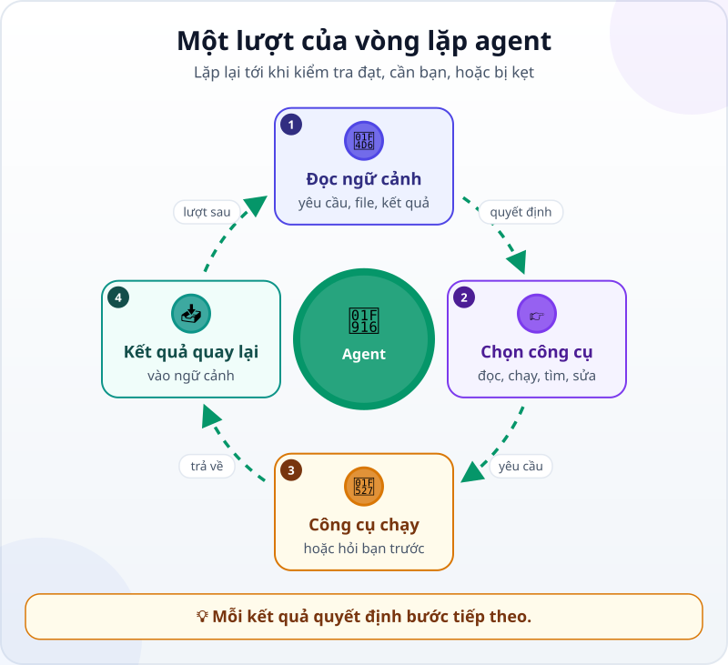
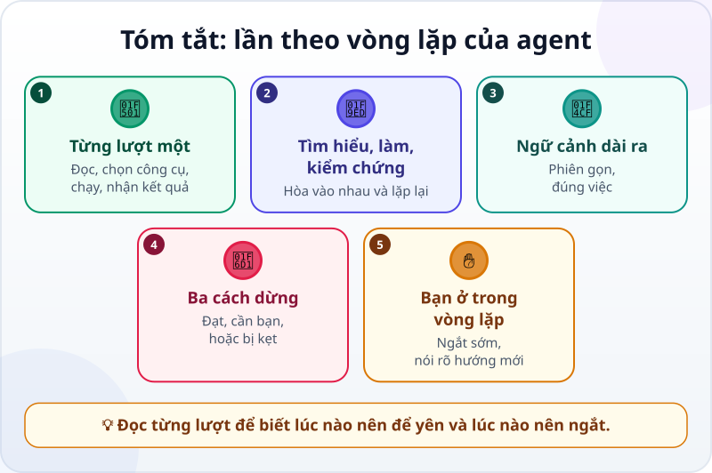

🌐 **Tiếng Việt** · [English](../../en/lessons/the-agent-loop.md) · [日本語](../../ja/lessons/the-agent-loop.md)

# Lần theo vòng lặp của agent qua một phiên làm việc thật

<!-- section: objective -->
## Mục tiêu bài học

Sau bài này, bạn sẽ:

- Đọc được một phiên làm việc theo từng **lượt**: ở lượt dùng công cụ, mô hình đọc ngữ cảnh → chọn công cụ → công cụ chạy → kết quả quay lại ngữ cảnh; lượt cuối là câu trả lời cho bạn.
- Phân biệt được khi nào vòng lặp kết thúc (phép kiểm tra đạt, hoặc bị kẹt) và khi nào nó chỉ tạm dừng chờ bạn quyết định.
- Biết lúc nào nên ngắt agent và nói gì để chỉnh hướng.

<!-- section: hook -->
## Mở đầu: vì sao nên quan tâm?

Mai đã có chương trình `lam_bao_cao.py` từ [dự án tự động hóa báo cáo](project-office-automation.md). Tháng 11, báo cáo bỗng có **hai dòng "Quan 1"** trong bảng chi nhánh, và tổng của mỗi dòng đều nhỏ hơn thực tế.

Cô giao việc sửa cho agent. Hai phút sau, màn hình đã chạy qua chín bước: đọc file, chạy lệnh, tìm kiếm, sửa, chạy lại… Mọi thứ trôi qua rất nhanh. Nếu có bước nào đi sai, Mai có nhận ra kịp không?

Bài này đọc chậm lại đúng phiên đó, từng lượt một.

<!-- section: concept -->
## Nội dung chính

### Một lượt của vòng lặp

Bạn đã biết agent gồm [bộ não, đôi tay và vòng lặp](agent-parts-and-loop.md), và mô hình chỉ [*yêu cầu* dùng công cụ](tool-calling.md), còn phần mềm bao quanh mới thực sự chạy nó. Khi lần theo một phiên thật, mỗi **lượt** có dùng công cụ gồm bốn bước:



1. **Đọc ngữ cảnh:** mô hình đọc mọi thứ đang có — yêu cầu của bạn, các file đã mở, kết quả của những lượt trước.
2. **Chọn công cụ:** nó quyết định bước tiếp theo và yêu cầu một công cụ — đọc file, chạy lệnh, tìm kiếm, sửa file.
3. **Công cụ chạy:** phần mềm của agent chạy công cụ đó (hoặc hỏi bạn trước, nếu việc đó cần xin phép).
4. **Kết quả quay lại:** kết quả — nội dung file, thông báo lỗi, con số — được thêm vào ngữ cảnh.

Rồi lượt sau bắt đầu, với ngữ cảnh đã dài thêm một chút.

Không phải lượt nào cũng dùng công cụ. Khi mô hình thấy việc đã xong, hoặc cần hỏi bạn, nó không chọn công cụ nào mà viết câu trả lời cho bạn — như lượt cuối trong ví dụ dưới đây. Đó là lúc vòng lặp dừng.

### Ba giai đoạn hòa vào nhau

Tài liệu Claude Code (9/2026) mô tả vòng lặp của agent qua ba giai đoạn: **thu thập ngữ cảnh**, **hành động**, và **kiểm chứng kết quả**. Chúng không tách bạch: một việc sửa lỗi có thể đi qua cả ba giai đoạn nhiều lần. Mỗi kết quả công cụ trả về là thông tin mới giúp chọn bước tiếp theo.

### Ngữ cảnh dài ra sau mỗi lượt

Kết quả của mỗi lượt được thêm vào ngữ cảnh. Một phiên dài, đọc nhiều file lớn, sẽ đầy dần [cửa sổ ngữ cảnh](context-window.md). Khi gần đầy, công cụ phải dọn bớt: tính đến tháng 9/2026, Claude Code xóa các kết quả công cụ cũ trước, rồi tóm tắt cuộc trò chuyện — và những chỉ dẫn chi tiết từ đầu phiên có thể bị mất. Đó là lý do một phiên gọn gàng, đúng việc, thường cho kết quả tốt hơn một phiên kéo dài với nhiều lần sửa đi sửa lại.

### Vòng lặp kết thúc — hay chỉ tạm dừng?

- **Kết thúc vì phép kiểm tra đạt:** agent chạy phép kiểm tra bạn đưa, thấy đạt, và trả lời bạn bằng một báo cáo.
- **Kết thúc vì bị kẹt:** cùng một lệnh, cùng một lỗi, lặp lại. Agent có thể tự nhận ra và dừng — hoặc không. Đây là lúc bạn nên ngắt.
- **Tạm dừng vì cần bạn quyết định:** một việc nằm ngoài quyền của nó — xóa, cài đặt, sửa thứ bạn đã dặn không được sửa. Agent chờ; bạn trả lời xong thì vòng lặp chạy tiếp, như lượt 5 và 6 trong ví dụ dưới đây.

### Bạn cũng ở trong vòng lặp

Bạn có thể ngắt agent bất cứ lúc nào để chỉnh hướng, thêm thông tin, hay bảo nó thử cách khác. Trong Claude Code (9/2026), phím **Esc** dừng agent ngay, ngữ cảnh vẫn còn, và bạn gõ hướng mới. Chỉnh sớm thường nhanh hơn chờ agent đi hết một hướng sai.

<!-- section: example -->
## Ví dụ thực tế

Mai giao việc trong thư mục `ai-practice`, ở chế độ agent hỏi trước khi sửa file:

```text
Báo cáo tháng 11 có hai dòng "Quan 1" trong bảng chi nhánh. Sửa lam_bao_cao.py để gộp đúng.
Không sửa file dữ liệu.
Xong khi:
1. Bảng chi nhánh tháng 11 có đúng 2 dòng, tổng khớp kết quả đúng mình dán kèm.
2. Phép kiểm tra kiem_tra.py vẫn ĐẠT cho tháng 9 và tháng 10.
```

(`kiem_tra.py` là phép kiểm tra tự động Mai làm trong dự án: so báo cáo với bảng kết quả đúng.)

Đây là phiên làm việc, đọc từng lượt. Mỗi lượt ghi: agent chọn công cụ nào, và kết quả gì quay lại.

**Lượt 1 — thu thập ngữ cảnh.** Công cụ: *liệt kê thư mục*. Kết quả: `lam_bao_cao.py`, `kiem_tra.py`, ba file `ban_hang_thang_9/10/11.csv`.

**Lượt 2 — tái hiện lỗi.** Công cụ: *chạy lệnh* `python lam_bao_cao.py ban_hang_thang_11.csv`. Kết quả: bảng chi nhánh có ba dòng — `Quan 1`, `Thu Duc`, và lại `Quan 1`. Agent đã thấy tận mắt lỗi Mai kể.

**Lượt 3 — đọc code.** Công cụ: *đọc file* `lam_bao_cao.py`. Kết quả: chương trình gộp doanh thu theo đúng chữ trong cột `chi_nhanh`, từng ký tự một.

**Lượt 4 — tìm nguyên nhân.** Công cụ: *tìm kiếm* chữ `Quan 1` trong `ban_hang_thang_11.csv`. Kết quả: có một dòng ghi `Quan 1 ` — thừa một khoảng trắng ở cuối. Với máy tính, đó là một chi nhánh khác.

**Lượt 5 — xin phép, bị từ chối.** Agent muốn *sửa file* `ban_hang_thang_11.csv` để xóa khoảng trắng, nên hỏi Mai. Mai bấm **từ chối** và gõ: *"Không sửa file dữ liệu. Tháng sau có thể lại có khoảng trắng — sửa chương trình để nó bỏ khoảng trắng thừa khi đọc."* Câu trả lời của Mai đi vào ngữ cảnh như một kết quả mới.

**Lượt 6 — hành động.** Công cụ: *sửa file* `lam_bao_cao.py`: bỏ khoảng trắng ở đầu và cuối tên chi nhánh trước khi gộp. Mai đồng ý. Kết quả: một dòng thay đổi.

**Lượt 7 — kiểm chứng.** Công cụ: *chạy lệnh* báo cáo tháng 11. Kết quả: 2 dòng chi nhánh, tổng khớp bảng kết quả đúng.

**Lượt 8 — kiểm chứng thêm.** Công cụ: *chạy lệnh* `python kiem_tra.py` cho tháng 9 và tháng 10. Kết quả: ĐẠT cả hai. Bản sửa không làm hỏng tháng cũ.

**Lượt 9 — báo cáo.** *"Nguyên nhân: một dòng tháng 11 ghi 'Quan 1 ' thừa khoảng trắng. Đã sửa lam_bao_cao.py để bỏ khoảng trắng thừa. Đã kiểm tra: tháng 11 có 2 chi nhánh, khớp kết quả đúng; tháng 9 và 10 vẫn ĐẠT. Chưa kiểm tra: tên viết khác kiểu, như 'quan 1' chữ thường."*

Vòng lặp dừng vì phép kiểm tra đạt. Mai không dừng ở đó: cô đọc diff — đúng một dòng đổi — rồi tự cộng doanh thu chi nhánh Quận 1 trong file tháng 11 bằng máy tính và so với báo cáo. Khớp. Còn dòng "chưa kiểm tra", cô ghi lại để tháng sau hỏi thêm.

Để ý **lượt 5**. Nếu Mai bấm đồng ý cho nhanh, lỗi tháng 11 cũng hết — nhưng file dữ liệu gốc đã bị sửa, và tháng 12 lỗi sẽ quay lại. Một câu trả lời của bạn giữa vòng lặp có thể quan trọng hơn cả tám lượt còn lại.

<!-- section: try-it -->
## Thử ngay

Khoảng 5 phút, không cần cài gì. Tuấn nhờ agent sửa một chương trình đổi đơn vị đo. Đây là một đoạn phiên làm việc của anh:

```text
Lượt 4: chạy lệnh python doi_don_vi.py  → Lỗi: không tìm thấy module 'pandas'
Lượt 5: chạy lệnh pip install pandas    → Bị chặn: máy công ty không cho cài đặt
Lượt 6: chạy lệnh pip install pandas    → Bị chặn: máy công ty không cho cài đặt
Lượt 7: chạy lệnh pip install --user pandas → Bị chặn: máy công ty không cho cài đặt
```

Tự trả lời:

1. Vòng lặp đang ở trạng thái nào: đang tiến, cần quyết định, hay bị kẹt?
2. Tuấn nên ngắt ở lượt nào, và nói gì với agent?

<details>
<summary>Gợi ý đáp án</summary>

1. **Bị kẹt** — cùng một việc, cùng một kết quả, lặp lại. Tệ hơn, lượt 7 đang thử một cách khác để vượt qua quy định của máy công ty: đó là việc ⛔ không bao giờ làm.
2. Ngắt ngay sau **lượt 5**, khi kết quả cho thấy máy không cho cài đặt. Ví dụ: *"Dừng lại, không cài gì trên máy này. Viết lại chương trình chỉ dùng thư viện có sẵn của Python, rồi chạy lại."* Nếu việc thật sự cần thư viện đó, hỏi bộ phận IT theo đúng quy trình.

</details>

<!-- section: misconceptions -->
## Hiểu lầm thường gặp

- **"Agent làm một mạch từ đầu đến cuối."** — Nó làm từng lượt, và mỗi lượt dựa vào kết quả của lượt trước. Kết quả sai hay thiếu ở một lượt kéo theo những lượt sau.
- **"Ngắt agent là làm hỏng việc của nó."** — Ngắt giữ nguyên ngữ cảnh; bạn chỉ thêm hướng mới. Chỉnh sớm rẻ hơn chờ nó đi hết một hướng sai.
- **"Agent dừng tức là đã xong."** — Nó có thể dừng vì phép kiểm tra đạt, vì đang chờ bạn quyết định, hoặc vì hết cách. Đọc báo cáo để biết là trường hợp nào.

<!-- section: recap -->
## Tóm tắt bằng hình



<!-- section: takeaways -->
## Ghi nhớ

- Mỗi lượt dùng công cụ: đọc ngữ cảnh → chọn công cụ → công cụ chạy → kết quả quay lại ngữ cảnh.
- Tìm hiểu, hành động, kiểm chứng hòa vào nhau và có thể lặp lại nhiều lần.
- Ngữ cảnh dài ra sau mỗi lượt; phiên gọn và đúng việc thường tốt hơn.
- Vòng lặp kết thúc khi phép kiểm tra đạt hoặc khi bị kẹt; nó tạm dừng khi cần bạn quyết định, rồi chạy tiếp.
- Bạn ở trong vòng lặp: ngắt sớm, nói rõ hướng mới, và vẫn tự kiểm tra kết quả cuối.

<!-- section: quiz -->
## Tự kiểm tra

**Câu 1.** Sau khi một công cụ chạy xong, kết quả của nó đi đâu?

- A) Hiện cho bạn xem rồi mất đi
- B) Vào ngữ cảnh, để mô hình đọc và chọn bước tiếp theo
- C) Được lưu vào một file mà mô hình không bao giờ đọc

**Câu 2.** Agent chạy cùng một lệnh và gặp cùng một lỗi lần thứ ba. Bạn nên làm gì?

- A) Chờ thêm, thế nào nó cũng qua được
- B) Cho phép nó làm mọi thứ để nó tự tìm đường
- C) Ngắt, rồi đưa thêm thông tin hoặc chỉ một hướng khác

**Câu 3.** Trong phiên của Mai, vì sao agent chạy lại phép kiểm tra cho tháng 9 và tháng 10?

- A) Để chắc bản sửa cho tháng 11 không làm hỏng các tháng trước
- B) Vì agent luôn phải chạy mọi thứ ba lần
- C) Để ngữ cảnh dài hơn

<details>
<summary>Xem đáp án</summary>

1. **B** — kết quả công cụ là thông tin mới trong ngữ cảnh; lượt sau dựa vào nó.
2. **C** — lặp lại cùng một lỗi là dấu hiệu bị kẹt; một câu chỉnh hướng của bạn giúp nhanh hơn chờ đợi.
3. **A** — sửa chỗ này có thể làm hỏng chỗ khác; chạy lại phép kiểm tra cũ là cách biết chắc.

</details>

<!-- section: sources -->
## Nguồn tham khảo

- Anthropic — [How Claude Code works](https://code.claude.com/docs/en/how-claude-code-works) (tiếng Anh, tính đến 9/2026): vòng lặp gồm thu thập ngữ cảnh, hành động và kiểm chứng kết quả, hòa vào nhau; mỗi lần dùng công cụ trả về thông tin cho bước tiếp theo; bạn có thể ngắt bất cứ lúc nào để chỉnh hướng; khi ngữ cảnh gần đầy, kết quả công cụ cũ bị dọn trước rồi cuộc trò chuyện được tóm tắt.
- Anthropic — [Best practices for Claude Code](https://code.claude.com/docs/en/best-practices) (tiếng Anh, tính đến 9/2026): chỉnh hướng sớm và thường xuyên; phím Esc dừng Claude mà vẫn giữ ngữ cảnh; nếu đã phải sửa cùng một chuyện hơn hai lần trong một phiên, hãy bắt đầu phiên mới với yêu cầu rõ hơn.
