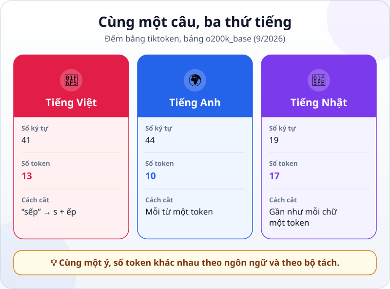
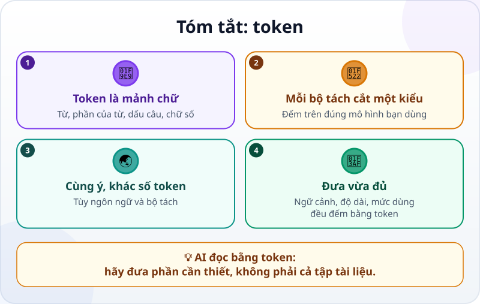

🌐 **Tiếng Việt** · [English](../../en/lessons/tokens.md) · [日本語](../../ja/lessons/tokens.md)

# Token: AI đọc chữ theo từng mảnh

<!-- section: objective -->
## Mục tiêu bài học

Sau bài này, bạn sẽ:

- Giải thích được **token** là gì, và vì sao nó không phải là một từ hay một chữ cái.
- Xem được một câu bị cắt thành token, và thấy số token đổi theo ngôn ngữ và theo bộ tách token.
- Biết những gì được đếm bằng token, để đưa cho AI vừa đủ thay vì cả tập tài liệu.

<!-- section: hook -->
## Mở đầu: vì sao nên quan tâm?

Tuấn là kỹ sư cơ khí ở Nhật. Mỗi ngày anh viết cho gia đình bằng tiếng Việt, cho đồng nghiệp bằng tiếng Nhật và viết báo cáo bằng tiếng Anh. Đọc tài liệu công cụ AI công ty cho dùng, anh thấy mọi giới hạn đều ghi bằng một đơn vị lạ: **token**. Không phải số trang, không phải số từ.

Một token là bao nhiêu chữ? Cùng một ý viết bằng ba thứ tiếng thì có tốn như nhau không? Bài này cho bạn xem tận mắt.

<!-- section: concept -->
## Nội dung chính

### Token là mảnh chữ mà mô hình đọc và viết

Trong bài [Đoán chữ tiếp theo](next-token-prediction.md), bạn đã biết LLM viết câu trả lời mỗi lần một token. Trước khi mô hình đọc được câu của bạn, một chương trình gọi là **bộ tách token (tokenizer)** cắt câu thành từng mảnh, rồi đổi mỗi mảnh thành một con số. Mô hình chỉ làm việc với chuỗi số đó.

Một token có thể là cả một từ, một phần của từ, một dấu câu, một chữ số, thậm chí một mẩu của một ký tự. Bộ tách token có sẵn một "bộ mảnh" cố định: chuỗi chữ gặp thường xuyên trong dữ liệu được một mảnh riêng; chuỗi hiếm thì bị cắt nhỏ hơn.

### Mỗi bộ tách cắt một kiểu

Không có một cách cắt chung cho mọi AI. Mỗi họ mô hình thường có bộ tách token riêng, và bộ tách có thể đổi giữa các đời mô hình. Tài liệu của Anthropic (tính đến 9/2026) nói: các mô hình Claude từ bản 4.7 dùng bộ tách mới, và cùng một đoạn chữ cho ra khoảng 30% token nhiều hơn so với các mô hình trước. Vì vậy, một con số token chỉ đúng với bộ tách đã đếm nó.

### Những gì được đếm bằng token

- **[Cửa sổ ngữ cảnh](context-window.md):** lượng chữ mô hình xem được cùng lúc — tin nhắn, file, kết quả lệnh — đều tính bằng token.
- **Độ dài câu trả lời:** công cụ thường đặt giới hạn số token cho mỗi câu trả lời.
- **Mức sử dụng:** nhiều gói dịch vụ và API tính giới hạn hay chi phí theo số token đi vào và đi ra.

Bạn không cần đếm token bằng tay. Nhưng biết đơn vị đo giúp bạn hiểu vì sao một tài liệu dài bị báo "quá dài", hay vì sao phiên làm việc đầy nhanh hơn bạn nghĩ.

<!-- section: analogy -->
## Ví dụ đời thường

Hãy tưởng tượng một tiệm khắc dấu có sẵn một hộp con dấu. Chữ hay gặp như *"cảm ơn"* hay *"hàng"* có con dấu riêng, đóng một lần là xong. Tên lạ hay từ hiếm không có dấu riêng, phải ghép từ nhiều con dấu nhỏ. Tiệm khác có hộp dấu khác, nên cùng một câu có thể cần số lần đóng dấu khác nhau.

Phép so sánh sai ở chỗ: con dấu thường là một chữ trọn vẹn, còn token thì không nhất thiết có nghĩa. Một từ có thể bị cắt ở giữa, như *"sếp"* trong ví dụ dưới đây. Và hộp dấu không đổi theo từng câu bạn viết: nó được làm sẵn cùng với mô hình.

<!-- section: example -->
## Ví dụ thực tế

Tuấn thử một câu với ba thứ tiếng. Anh cắt câu bằng **tiktoken**, bộ tách token mã nguồn mở của OpenAI (bản JavaScript), bảng `o200k_base`, tháng 9/2026. Mỗi cặp ngoặc vuông là một token; dấu cách thường dính vào đầu token đi sau nó.

```text
Tiếng Việt: [Mai][ gửi][ báo][ cáo][ bán][ hàng][ tháng][ ][6][ cho][ s][ếp][.]
Tiếng Anh:  [Mai][ sends][ the][ June][ sales][ report][ to][ her][ boss][.]
Tiếng Nhật: [マ][イ][は][6][月][の][売][上][報][告][を][上][司][に][送][ります][。]
```



Tuấn rút ra ba điều:

1. **Một token không phải một từ.** *"sếp"* bị cắt làm hai: `[ s]` và `[ếp]`. Con số `6`, dấu cách trước nó và dấu chấm cuối câu đều là token riêng: câu tiếng Anh có 9 từ nhưng 10 token.
2. **Cùng ý, khác số token.** Câu tiếng Anh cần 10 token, tiếng Việt 13, tiếng Nhật 17 — dù câu tiếng Nhật chỉ có 19 ký tự. Ở bảng này, chữ Hán gần như mỗi chữ là một token.
3. **Đổi bộ tách, đổi con số.** Cũng câu tiếng Việt đó, cắt bằng bảng cũ hơn `cl100k_base` của cùng thư viện, ra **22** token thay vì 13: nhiều âm tiết có dấu bị cắt vụn, như `[ g][ử][i]`.

Kết luận của Tuấn: con số không quan trọng bằng thói quen. Khi nhờ AI đọc một tài liệu dài, anh chỉ đưa phần liên quan, vì phần thừa cũng chiếm chỗ trong cửa sổ ngữ cảnh — bất kể viết bằng thứ tiếng nào.

<!-- section: try-it -->
## Thử ngay

Khoảng 3 phút, không cần cài gì. Dùng cùng bảng `o200k_base` như trên, hãy **đoán thứ tự từ ít token nhất đến nhiều token nhất**:

- A) `Cảm ơn anh nhiều.`
- B) `Thanks a lot.`
- C) `ありがとうございます。`
- D) `27/09/2026`

Ghi đáp án của bạn ra giấy trước, rồi mới mở phần kết quả.

<details>
<summary>Xem kết quả</summary>

- **C) 2 token:** `[ありがとうございます][。]` — cả cụm cảm ơn quen thuộc là một mảnh.
- **B) 4 token:** `[Thanks][ a][ lot][.]`
- **D) 6 token:** `[27][/][09][/][202][6]` — một ngày tháng không phải một token.
- **A) 7 token:** `[C][ảm][ ][ơn][ anh][ nhiều][.]`

Nếu bạn đoán câu tiếng Nhật tốn nhiều nhất, có lẽ là vì câu ở phần trên: ở đó tiếng Nhật tốn nhiều token nhất. Nhưng một cụm hay gặp thì thành một mảnh, dù nó dài.

</details>

<!-- section: misconceptions -->
## Hiểu lầm thường gặp

- **"Một token là một từ."** — Có khi là một từ, có khi là một phần của từ, một dấu câu hay một chữ số.
- **"Đếm ở công cụ này thì đúng cho mọi AI."** — Mỗi bộ tách cắt một kiểu, và bộ tách có thể đổi giữa các đời mô hình. Muốn số chính xác, đếm bằng công cụ đếm token của đúng mô hình bạn dùng.
- **"Tiếng Việt lúc nào cũng tốn gấp đôi tiếng Anh."** — Tùy bộ tách: trong ví dụ trên, cùng câu tiếng Việt ra 13 token với bảng này và 22 token với bảng kia. Đừng nhớ một tỷ lệ cố định.

<!-- section: recap -->
## Tóm tắt bằng hình



<!-- section: takeaways -->
## Ghi nhớ

- Token là mảnh chữ mô hình đọc và viết: từ, phần của từ, dấu câu hay chữ số.
- Bộ tách token cắt câu thành mảnh; mỗi họ mô hình thường có bộ tách riêng.
- Cùng một ý, số token khác nhau theo ngôn ngữ và theo bộ tách.
- Cửa sổ ngữ cảnh, độ dài câu trả lời và mức sử dụng đều đếm bằng token — hãy đưa cho AI vừa đủ.

<!-- section: quiz -->
## Tự kiểm tra

**Câu 1.** Token là gì?

- A) Luôn luôn là một từ trọn vẹn
- B) Luôn luôn là một chữ cái
- C) Một mảnh chữ do bộ tách token cắt ra: có thể là từ, phần của từ hay dấu câu

**Câu 2.** Cùng câu tiếng Việt ra 13 token với bảng này và 22 token với bảng kia. Vì sao?

- A) Vì hai bộ tách token có bộ mảnh khác nhau
- B) Vì một trong hai lần đếm bị lỗi
- C) Vì câu tiếng Việt được dịch sang tiếng Anh trước khi đếm

**Câu 3.** Tuấn muốn AI trả lời một câu hỏi về một mục trong tài liệu kỹ thuật 200 trang. Cách nào hợp lý nhất?

- A) Dán cả 200 trang, vì càng nhiều thông tin càng tốt
- B) Chỉ đưa mục liên quan, vì mọi phần dán vào đều chiếm token trong cửa sổ ngữ cảnh
- C) Dịch tài liệu sang tiếng Anh cho chắc chắn ít token hơn

<details>
<summary>Xem đáp án</summary>

1. **C** — token có thể là từ, phần của từ, dấu câu hay chữ số, tùy bộ tách.
2. **A** — mỗi bộ tách có bộ mảnh riêng, nên cùng câu có thể ra số token khác nhau.
3. **B** — phần thừa cũng chiếm chỗ; còn dịch sang tiếng Anh chưa chắc ít token hơn và dễ làm sai nội dung.

</details>

<!-- section: sources -->
## Nguồn tham khảo

- Anthropic — [Glossary](https://platform.claude.com/docs/en/about-claude/glossary) (tiếng Anh), mục *Tokens*: token có thể là từ, phần của từ, ký tự hay byte; với Claude, một token trung bình khoảng 3,5 ký tự tiếng Anh, và con số này đổi theo ngôn ngữ.
- Anthropic — [Token counting](https://platform.claude.com/docs/en/build-with-claude/token-counting) (tiếng Anh, tính đến 9/2026): đếm token trước khi gửi; từ Claude 4.7, bộ tách mới cho ra khoảng 30% token nhiều hơn với cùng đoạn chữ, nên hãy đếm lại trên đúng mô hình mình dùng.
- OpenAI — [tiktoken](https://github.com/openai/tiktoken) (tiếng Anh): bộ tách token mã nguồn mở; mô hình không đọc chữ mà đọc một chuỗi số gọi là token, và trung bình mỗi token ứng với khoảng 4 byte. Mọi con số trong bài được đếm bằng bản JavaScript `js-tiktoken` 1.0.21, bảng `o200k_base` và `cl100k_base`, tháng 9/2026.
