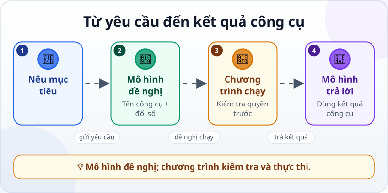
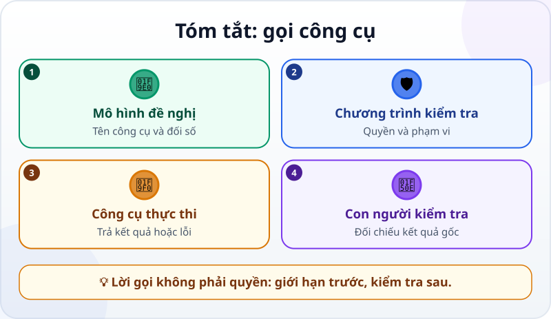

🌐 **Tiếng Việt** · [English](../../en/lessons/tool-calling.md) · [日本語](../../ja/lessons/tool-calling.md)

# Gọi công cụ: cách LLM "bấm nút" ngoài đời thật

<!-- section: objective -->
## Mục tiêu bài học

Sau bài này, bạn sẽ:

- Phân biệt yêu cầu gọi công cụ của mô hình với việc chương trình thật sự chạy công cụ.
- Đọc được một lượt gọi công cụ gồm tên, đối số và kết quả.
- Nhận ra chỗ cần kiểm tra quyền hạn, dữ liệu đầu vào và kết quả.

<!-- section: hook -->
## Mở đầu: vì sao nên quan tâm?

Hana hỏi chatbot: *“Trong `ai-practice/meeting.txt`, cuộc họp bắt đầu lúc mấy giờ?”* Mô hình chỉ nhận được câu hỏi thì không thể biết chữ trong file. Nó cũng không có bàn tay để tự bấm nút “Mở”.

Muốn trả lời, nó cần một **công cụ (tool)** đọc file. Nhưng mô hình không trực tiếp chạy công cụ: nó đề nghị một lời gọi, còn chương trình bao quanh mới quyết định có cho chạy hay không.

<!-- section: concept -->
## Nội dung chính

**Gọi công cụ (tool calling hay function calling)** là cơ chế để mô hình trả về một yêu cầu có cấu trúc. Yêu cầu nói rõ:

- **Tên công cụ:** muốn dùng khả năng nào, chẳng hạn `read_file`.
- **Đối số:** dữ liệu công cụ cần, chẳng hạn đường dẫn `ai-practice/meeting.txt`.



Luồng công việc có bốn vai trò rõ ràng:

1. **Người dùng** nêu mục tiêu.
2. **Mô hình** chọn một công cụ và tạo lời gọi có cấu trúc.
3. **Chương trình bao quanh** kiểm tra quyền, chạy công cụ và nhận kết quả.
4. **Mô hình** đọc kết quả được đưa lại vào cuộc trò chuyện rồi viết câu trả lời.

Đây không phải câu thần chú. Tên công cụ và đối số phải khớp với những gì chương trình cung cấp. Nếu không có công cụ đọc file, mô hình không thể tự tạo ra quyền đọc file. Nếu đường dẫn sai, công cụ trả lỗi; lỗi đó trở thành thông tin để mô hình sửa yêu cầu hoặc hỏi người dùng.

### Ba điểm kiểm soát

- **Trước khi chạy:** chương trình có thể chặn công cụ nguy hiểm hoặc xin phép. Đọc file giả trong `ai-practice` có thể là ✅ an toàn; xóa file, gửi email hay làm ngoài thư mục là ✋ hỏi trước; mật khẩu, khóa API và dữ liệu thật của công ty là ⛔ không đưa vào.
- **Trong khi chạy:** công cụ chỉ nhận các đối số đã được cho phép. Một đường dẫn cụ thể an toàn hơn quyền đọc mọi nơi.
- **Sau khi chạy:** kết quả công cụ là dữ liệu mới, chưa chắc là kết luận đúng. Mô hình có thể hiểu nhầm; người dùng vẫn kiểm tra câu trả lời với kết quả gốc.

Một lời gọi công cụ là phần **hành động** trong [vòng lặp của agent](agent-parts-and-loop.md): chọn hành động → chạy → quan sát kết quả → quyết định tiếp. Một câu hỏi đơn giản có thể chỉ cần một lượt; việc dài có thể lặp nhiều lượt.

<!-- section: example -->
## Ví dụ thực tế

Hãy xem một lượt trao đổi với dữ liệu hoàn toàn giả. File `ai-practice/meeting.txt` chứa:

```text
Họp nhóm dự án: 14:30 thứ Năm
Phòng: Sakura B
```

**Bước 1 — Hana hỏi**

> Trong `ai-practice/meeting.txt`, cuộc họp bắt đầu lúc mấy giờ? Chỉ đọc file đó.

**Bước 2 — mô hình đề nghị gọi công cụ**

```json
{"tool": "read_file", "arguments": {"path": "ai-practice/meeting.txt"}}
```

Đây mới là đề nghị có cấu trúc, chưa phải nội dung file. Mô hình đã chọn `read_file`; đối số `path` giới hạn đúng file Hana nêu.

**Bước 3 — chương trình kiểm tra và chạy**

Chương trình thấy đường dẫn nằm trong `ai-practice`, được phép đọc, rồi chạy công cụ. Công cụ trả về:

```text
Họp nhóm dự án: 14:30 thứ Năm
Phòng: Sakura B
```

**Bước 4 — kết quả quay lại mô hình**

Mô hình không cần đoán giờ nữa. Nó trả lời: *“Cuộc họp bắt đầu lúc 14:30 thứ Năm.”* Hana đối chiếu với dòng gốc và thấy khớp.

Giả sử mô hình gửi `ai-practice/meting.txt`, thiếu một chữ *e*. Công cụ sẽ trả *“không tìm thấy file”*. Kết quả lỗi cũng hữu ích: mô hình có thể kiểm tra tên file rồi thử lại. Nó không nên bịa nội dung để lấp chỗ trống.

Giả sử Hana yêu cầu gửi giờ họp qua email. Đó là một hành động khác: chương trình nên dừng để Hana xem người nhận và nội dung, rồi xin phép trước khi gửi. Mô hình đề nghị không đồng nghĩa với việc được phép thực hiện.

<!-- section: recap -->
## Tóm tắt bằng hình



<!-- section: takeaways -->
## Ghi nhớ

- Mô hình đề nghị lời gọi gồm tên công cụ và đối số; chương trình bao quanh mới chạy nó.
- Kết quả công cụ được đưa lại vào cuộc trò chuyện để mô hình quyết định hoặc trả lời.
- Công cụ chỉ làm được điều chương trình cung cấp và quyền hạn cho phép.
- Kiểm tra trước khi chạy, giới hạn đối số và đối chiếu kết quả sau khi chạy.
- Lời gọi công cụ là một lượt hành động và quan sát trong vòng lặp agent.

<!-- section: quiz -->
## Tự kiểm tra

**Câu 1.** Ai thật sự thực thi yêu cầu `read_file`?

- A) Mô hình tự mở ổ đĩa mà không cần chương trình
- B) Người viết nội dung file
- C) Chương trình bao quanh, sau khi kiểm tra lời gọi và quyền

**Câu 2.** Phần nào là đối số trong lời gọi ví dụ?

- A) Đường dẫn `ai-practice/meeting.txt`
- B) Tên công cụ `read_file`
- C) Câu trả lời cuối cùng cho Hana

**Câu 3.** Mô hình đề nghị công cụ gửi email. Điều gì nên xảy ra?

- A) Luôn gửi ngay vì mô hình đã chọn công cụ
- B) Chương trình dừng để người dùng kiểm tra và cho phép trước
- C) Đổi sang đọc một file rồi coi như đã gửi

<details>
<summary>Xem đáp án</summary>

1. **C** — mô hình tạo yêu cầu; chương trình kiểm tra và thực thi công cụ.
2. **A** — `read_file` là tên công cụ, còn đường dẫn là dữ liệu công cụ cần.
3. **B** — gửi ra ngoài là hành động cần người dùng xem và cho phép.

</details>
