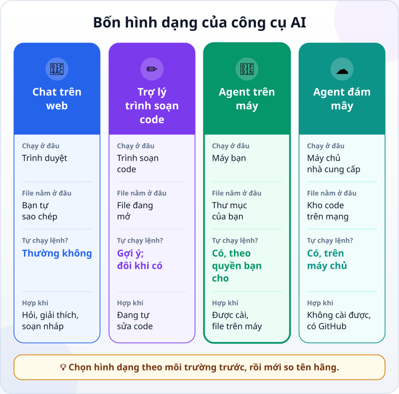
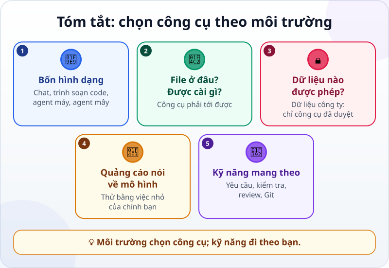

🌐 **Tiếng Việt** · [English](../../en/lessons/tool-landscape.md) · [日本語](../../ja/lessons/tool-landscape.md)

# Chọn công cụ theo môi trường, không theo lời quảng cáo

<!-- section: objective -->
## Mục tiêu bài học

Sau bài này, bạn sẽ:

- Nhận ra bốn **hình dạng** của công cụ AI cho việc làm phần mềm: chat trên web, trợ lý trong trình soạn code, agent trên máy, agent trên đám mây.
- Dùng bốn câu hỏi về môi trường để chọn hình dạng hợp với mình.
- Biết thứ gì mang theo được khi đổi công cụ: yêu cầu rõ, phép kiểm tra, review, Git.

<!-- section: hook -->
## Mở đầu: vì sao nên quan tâm?

Tuấn mở mạng xã hội buổi sáng: *"Công cụ X vừa ra mắt, bỏ xa mọi đối thủ!"* Tuần trước là công cụ Y. Tháng trước là Z. Một đồng nghiệp của anh đổi công cụ gần như mỗi tháng, và lần nào cũng mất vài buổi để làm quen lại.

Tuấn tự hỏi: mình có đang dùng sai công cụ không? Có nên đổi theo không?

Câu trả lời ít phụ thuộc vào bảng xếp hạng hơn bạn nghĩ. Nó phụ thuộc vào **chỗ bạn làm việc**.

<!-- section: concept -->
## Nội dung chính

### Bốn hình dạng của công cụ

Đừng bắt đầu bằng tên hãng. Hãy bắt đầu bằng hình dạng: công cụ chạy ở đâu, file nằm ở đâu, và nó tự làm được tới đâu.

- **💬 Chat trên web:** bạn hỏi, nó trả lời; thường thì bạn tự sao chép code ra, tự chạy trên máy mình. Đây là [chatbot, chưa phải agent](chatbot-to-agent.md).
- **✏️ Trợ lý trong trình soạn code:** gợi ý ngay trong file bạn đang sửa; nhiều trợ lý có thêm chế độ agent.
- **🤖 Agent trên máy:** chạy trên máy bạn — trong terminal hay một ứng dụng — đọc thư mục, sửa file, chạy lệnh. Đây là đường chính của khóa học.
- **☁️ Agent trên đám mây:** chạy trên máy chủ của nhà cung cấp, làm trên một kho code trên mạng; bạn xem và duyệt kết quả.

Cùng một hãng thường có nhiều hình dạng. Ví dụ, tính đến tháng 9/2026: Claude Code dùng được trong terminal, ứng dụng máy tính, trình soạn code, trình duyệt và cả Slack, với cùng một vòng lặp agent; Google Antigravity có bản ứng dụng máy tính và bản dòng lệnh. Vì vậy câu hỏi đúng không phải *"hãng nào?"*, mà là *"hình dạng nào, cho môi trường nào?"*.

### Bốn câu hỏi về môi trường

1. **File nằm ở đâu?** Trên máy bạn, trong một kho GitHub, hay trong một hệ thống của công ty? Công cụ phải đến được chỗ file.
2. **Bạn được cài và chạy gì?** Máy cá nhân thì thoải mái hơn; máy công ty thường chặn cài đặt. Không cài được thì chỉ còn trình duyệt hoặc công cụ công ty đã cài sẵn.
3. **Dữ liệu nào được phép đưa vào?** Dữ liệu giả thì đưa vào đâu cũng được. Dữ liệu công ty chỉ đi vào công cụ công ty đã duyệt — [việc bị cấm](data-safety-and-permissions.md) không đổi dù công cụ mạnh cỡ nào.
4. **Cần nó làm tới đâu?** Chỉ cần gợi ý và giải thích? Chat là đủ. Cần tự chạy lệnh, tự kiểm tra? Cần một agent — và cần quyền hạn rõ ràng cho nó.

Trả lời xong bốn câu, danh sách thường chỉ còn một hai hình dạng. Lúc đó mới so các công cụ cùng hình dạng với nhau.

### Lời quảng cáo nói gì, môi trường của bạn nói gì

Lời quảng cáo thường nói về **mô hình**: điểm số, tốc độ, bài kiểm tra chuẩn. Việc hằng ngày của bạn lại phụ thuộc vào **môi trường**: công cụ có vào được máy bạn không, có đọc được file của bạn không, có được phép thấy dữ liệu đó không. Một công cụ đứng đầu bảng xếp hạng mà không chạy được trên máy công ty thì với Tuấn, nó không dùng được.

Nếu vẫn muốn thử một công cụ mới, thử như trong [Chọn mô hình](choosing-models.md): cùng một việc nhỏ của chính bạn, có tiêu chí viết trước, dữ liệu giả, trong `ai-practice`. Kết quả của bạn đáng tin hơn một bài đăng.

### Thứ mang theo được

Công cụ đổi hằng tháng. Những gì bạn học trong khóa này thì không:

- [Viết yêu cầu tốt](writing-good-specs.md) với tiêu chí hoàn thành.
- Một phép kiểm tra agent tự chạy được.
- [Đọc diff](reviewing-agent-changes.md) và giữ lịch sử bằng [Git](git-version-control.md).

Ngay cả file chỉ dẫn cho agent cũng ngày càng dùng chung được: tính đến tháng 9/2026, Claude Code đọc file `CLAUDE.md` của nó, và cũng đọc được `AGENTS.md` — file mà các agent khác dùng. Đổi công cụ vì thế thường tốn vài buổi làm quen giao diện, không phải học lại từ đầu.

<!-- section: analogy -->
## Ví dụ đời thường

Chọn xe để đi làm. Quảng cáo nói chiếc ô tô mới nhanh nhất, êm nhất. Nhưng nếu nhà bạn ở trong hẻm nhỏ, chỗ làm không có bãi đỗ, thì chiếc xe máy cũ vẫn là lựa chọn đúng. Bạn chọn theo **đường bạn đi**, không theo bảng xếp hạng tốc độ. Và dù đi xe gì, luật giao thông, cách nhìn gương, cách giữ khoảng cách vẫn là của bạn.

Phép so sánh sai ở chỗ: xe cộ vài năm mới đổi một lần, còn công cụ AI đổi hằng tháng. Và xe không đọc giấy tờ của bạn — công cụ AI thì có thể thấy mọi dữ liệu bạn đưa vào. Vì vậy câu hỏi "dữ liệu nào được phép đưa vào?" quan trọng hơn mọi thông số.

<!-- section: example -->
## Ví dụ thực tế

Tuấn trả lời bốn câu hỏi cho **hai** môi trường của mình.

**Ở công ty:**

1. File: bản vẽ và bảng tính trên máy công ty và ổ mạng nội bộ.
2. Cài đặt: máy khóa, không cài được gì.
3. Dữ liệu: dữ liệu công ty chỉ được đưa vào công cụ công ty đã duyệt. Công ty đã duyệt một công cụ chat AI chạy trên trình duyệt.
4. Cần làm tới đâu: giải thích công thức Excel, soạn nháp email kỹ thuật — gợi ý là đủ.

→ Ở công ty, Tuấn dùng **đúng công cụ chat đã được duyệt**, cho đúng những việc được phép. Công cụ X trên mạng xã hội không qua được câu 2 và câu 3, nên dù nó mạnh cỡ nào cũng không phải lựa chọn ở đây.

**Ở nhà:**

1. File: thư mục `ai-practice` trên laptop cá nhân.
2. Cài đặt: được.
3. Dữ liệu: chỉ dữ liệu giả.
4. Cần làm tới đâu: tự chạy chương trình đổi đơn vị đo, tự chạy phép kiểm tra — cần một agent.

→ Ở nhà, Tuấn dùng **một agent trên máy** để học. Muốn thử công cụ X? Anh giao cho nó cùng việc nhỏ đã làm tuần trước, có tiêu chí sẵn, và so kết quả. Mất ba mươi phút, không phải cả tháng.

Tuấn không còn phải chạy theo mỗi bài đăng. Anh biết câu nào loại một công cụ ra khỏi danh sách của mình — và biết kỹ năng của anh vẫn nguyên dù đổi công cụ nào.

<!-- section: misconceptions -->
## Hiểu lầm thường gặp

- **"Công cụ mới nhất, điểm cao nhất, luôn là tốt nhất cho mình."** — Điểm số nói về mô hình trong một bài kiểm tra chuẩn. Công cụ không vào được máy bạn, hay không được phép thấy dữ liệu của bạn, thì không dùng được.
- **"Đổi công cụ là phải học lại từ đầu."** — Giao diện đổi; yêu cầu rõ, phép kiểm tra, review và Git thì mang theo được.
- **"Chọn một lần là xong."** — Môi trường thay đổi: công ty duyệt công cụ mới, bạn đổi máy, việc cần làm lớn hơn. Hỏi lại bốn câu mỗi khi môi trường đổi.

<!-- section: recap -->
## Tóm tắt bằng hình

<!-- section: takeaways -->
## Ghi nhớ

- Bốn hình dạng: chat trên web, trợ lý trong trình soạn code, agent trên máy, agent trên đám mây; một hãng thường có nhiều hình dạng.
- Bốn câu hỏi: file ở đâu, được cài gì, dữ liệu nào được phép, cần làm tới đâu.
- Quảng cáo nói về mô hình; việc hằng ngày phụ thuộc vào môi trường.
- Thử công cụ mới bằng việc nhỏ của chính bạn, có tiêu chí viết trước, dữ liệu giả.
- Kỹ năng mang theo được: yêu cầu rõ, phép kiểm tra, review, Git.

<!-- section: quiz -->
## Tự kiểm tra

**Câu 1.** Máy công ty của Tuấn không cài được gì, và dữ liệu công ty chỉ được đưa vào công cụ đã duyệt. Công cụ X đang được khen khắp nơi, cần cài đặt. Tuấn nên làm gì ở công ty?

- A) Cài thử công cụ X, vì nó mạnh hơn
- B) Dùng công cụ công ty đã duyệt; muốn dùng X thì đề nghị qua đúng quy trình
- C) Đưa dữ liệu công ty sang máy nhà để dùng X

**Câu 2.** Câu hỏi nào nên hỏi **trước** khi so điểm số của các công cụ?

- A) File của mình nằm ở đâu và công cụ có đến được đó không
- B) Công cụ nào có nhiều người theo dõi nhất
- C) Logo công cụ nào đẹp hơn

**Câu 3.** Khi đổi sang một công cụ agent khác, điều gì **vẫn dùng được** nguyên vẹn?

- A) Các phím tắt của công cụ cũ
- B) Tên các nút trong giao diện
- C) Cách viết yêu cầu có tiêu chí, phép kiểm tra và cách đọc diff

Xem đáp án

1. **B** — câu 2 và câu 3 đã loại công cụ X ở công ty; lách quy định hay mang dữ liệu ra ngoài là việc bị cấm.
2. **A** — công cụ không đến được chỗ file của bạn thì điểm số cao cũng không giúp gì.
3. **C** — giao diện thay đổi theo công cụ; kỹ năng làm việc với agent thì mang theo được.

<!-- section: sources -->
## Nguồn tham khảo

- Anthropic — [How Claude Code works](https://code.claude.com/docs/en/how-claude-code-works) (tiếng Anh, tính đến 9/2026): cùng một vòng lặp agent trong terminal, ứng dụng máy tính, trình soạn code, trình duyệt, Slack và CI/CD; chạy trên máy, trên đám mây hoặc điều khiển từ xa; Claude đọc `CLAUDE.md` và cũng đọc được `AGENTS.md` dành cho các agent khác.
- Google Cloud — [What is agentic coding?](https://cloud.google.com/discover/what-is-agentic-coding) (tiếng Anh, cập nhật 9/2026): Google Antigravity có bản ứng dụng máy tính và bản dòng lệnh; doanh nghiệp nên giới hạn những gì agent được truy cập và cho người review code của agent trước khi đưa vào dự án chính.
