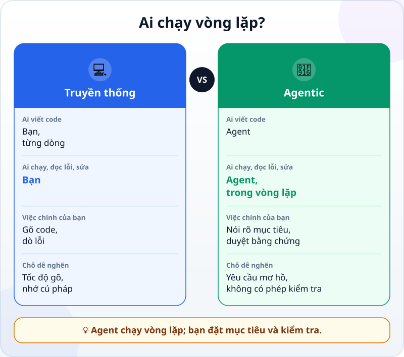
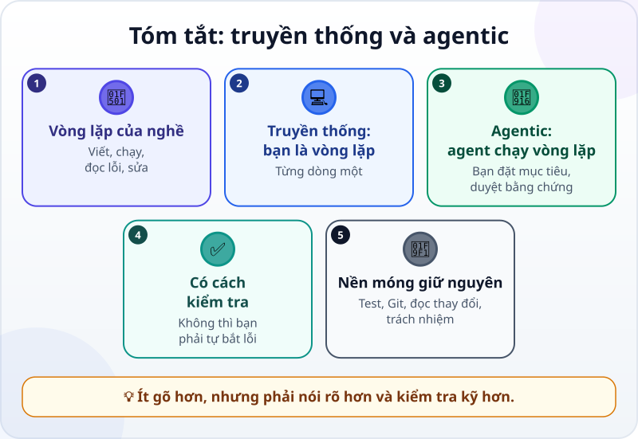

🌐 **Tiếng Việt** · [English](../../en/lessons/traditional-vs-agentic.md) · [日本語](../../ja/lessons/traditional-vs-agentic.md)

# Lập trình truyền thống và agentic coding

<!-- section: objective -->
## Mục tiêu bài học

Sau bài này, bạn sẽ:

- Mô tả được vòng **viết → chạy → đọc lỗi → sửa** và ai chạy vòng đó trong lập trình truyền thống và trong **agentic coding**.
- Giải thích được vì sao một cách kiểm tra agent tự chạy được là thứ quan trọng nhất bạn đưa cho nó.
- Kể được những gì không đổi: kết quả phải đúng, test, Git, đọc thay đổi và trách nhiệm của bạn.

<!-- section: hook -->
## Mở đầu: vì sao nên quan tâm?

Mai là kế toán, có 12 file doanh số giả, mỗi tháng một file, và muốn gộp thành một bảng cả năm. Hai năm trước, cô từng thử tự học Python để làm việc kiểu này: mất hai buổi cuối tuần, phần lớn thời gian là đọc thông báo lỗi và tìm trên mạng xem nó nghĩa là gì.

Tuần này, cô giao đúng việc đó cho một agent. Nửa tiếng sau, bảng đã xong và đã được kiểm tra. Cô không gõ dòng code nào — nhưng cô cũng không ngồi không. Vậy thứ gì đã thay đổi, và thứ gì vẫn như cũ?

<!-- section: concept -->
## Nội dung chính

### Vòng lặp của người lập trình

Viết phần mềm chưa bao giờ là viết một lần là xong. Người lập trình lặp đi lặp lại một vòng: **viết** một đoạn code → **chạy** thử → **đọc** kết quả hay thông báo lỗi → **sửa** → chạy lại. Một chương trình nhỏ có thể đi qua vòng này hàng chục lần.

### Truyền thống: bạn là vòng lặp

Trong lập trình truyền thống, bạn làm mọi bước của vòng đó: gõ từng dòng, tự chạy, tự đọc lỗi, tự tìm cách sửa. Tốc độ phụ thuộc vào việc bạn gõ nhanh cỡ nào, nhớ cú pháp tới đâu và đọc hiểu lỗi giỏi ra sao — đó là lý do Mai mất hai buổi cuối tuần.

### Agentic: agent chạy vòng lặp

Trong agentic coding, [agent](agent-parts-and-loop.md) tự chạy vòng đó: nó đọc file, viết code, chạy lệnh, đọc lỗi và sửa, rồi chạy lại. Tài liệu Claude Code (9/2026) mô tả sự thay đổi này: thay vì tự viết code rồi nhờ AI xem lại, bạn mô tả điều mình muốn và agent tìm cách làm ra nó.



Việc của bạn dồn về hai đầu vòng lặp:

- **Đầu vào:** nói rõ mục tiêu, bối cảnh, ranh giới — như bạn đã tập trong [Viết yêu cầu tốt](writing-good-specs.md).
- **Đầu ra:** duyệt bằng chứng và thay đổi, rồi quyết định có nhận hay không — như trong [Đọc và review thay đổi của agent](reviewing-agent-changes.md).

### Thứ quan trọng nhất bạn đưa cho agent: một cách kiểm tra

Agent dừng khi việc *trông như* đã xong. Tài liệu Claude Code nói rõ: nếu không có phép kiểm tra nào agent tự chạy được, "trông như xong" là tín hiệu duy nhất, và **chính bạn trở thành vòng kiểm tra** — mọi lỗi đều phải chờ bạn phát hiện. Còn nếu có một phép kiểm tra cho ra *đạt / không đạt* — một [bài test](testing-basics.md), một con số phải khớp — agent tự làm, tự kiểm tra, đọc kết quả và sửa tới khi đạt.

Vì vậy, chỗ nghẽn đã chuyển chỗ. Không còn là "gõ nhanh cỡ nào", mà là "yêu cầu rõ tới đâu" và "kiểm tra được bằng cách nào".

### Điều gì không đổi

- **Kết quả vẫn phải đúng.** Code chạy được chưa chắc đã làm đúng việc.
- **Test, [Git](git-version-control.md) và việc đọc thay đổi** vẫn là nền móng; agent làm nhanh hơn, nên chúng còn quan trọng hơn.
- **Trách nhiệm vẫn là của bạn**, như trong [Bạn là trưởng nhóm, không phải người gõ code](lead-not-typist.md).

<!-- section: analogy -->
## Ví dụ đời thường

Giặt tay và giặt máy. Giặt tay, bạn tự làm từng bước: ngâm, vò, xả, vắt, nhìn xem sạch chưa rồi vò lại. Giặt máy, bạn chọn chương trình, cho đồ vào, và máy tự chạy vòng giặt – xả – vắt. Việc của bạn chuyển thành chọn đúng chương trình, không bỏ nhầm đồ, và kiểm tra quần áo khi máy xong.

Phép so sánh sai ở chỗ: máy giặt chạy đúng một chương trình cố định. Agent thì tự quyết định từng bước, có thể làm điều bạn không ngờ tới, và có thể báo "xong rồi" khi việc chưa xong. Vì vậy bạn cần ranh giới rõ và bằng chứng, không chỉ một nút bấm.

<!-- section: example -->
## Ví dụ thực tế

Việc của Mai: gộp 12 file `thang_01.csv` … `thang_12.csv` (dữ liệu giả, cột `ngay, san_pham, doanh_thu`) thành `ca_nam.csv`, mỗi tháng một dòng tổng.

**Cách truyền thống — lần thử hai năm trước.** Mai tự học cách đọc file bằng Python, viết vòng lặp, chạy. Lỗi đầu tiên là thông báo về mã hóa chữ tiếng Việt — cô mất một buổi tìm hiểu nó nghĩa là gì. Sửa xong, chạy được, nhưng tổng tháng Một lớn bất thường: hóa ra dòng tiêu đề của mỗi file bị lẫn vào dữ liệu. Mỗi vòng viết – chạy – đọc lỗi – sửa đều do cô làm.

**Cách agentic — tuần này.** Mai viết yêu cầu, phần quan trọng nhất là cách kiểm tra:

```text
Gộp 12 file thang_01.csv ... thang_12.csv thành ca_nam.csv, mỗi tháng một dòng tổng doanh_thu.
Không sửa các file gốc. Dữ liệu là giả.
Xong khi:
1. ca_nam.csv có đúng 12 dòng tháng và một dòng Tong cong.
2. Tong cong bằng tổng cột doanh_thu của cả 12 file, tính riêng bằng một cách khác.
Chạy phép kiểm tra đó và cho mình xem kết quả.
```

Agent viết code, chạy, tự gặp đúng lỗi mã hóa chữ mà Mai từng gặp, tự sửa, chạy lại, rồi chạy phép kiểm tra và cho Mai xem: 12 dòng tháng, hai con số tổng khớp nhau. Mai không dừng ở đó: cô mở `thang_03.csv`, tự cộng cột doanh thu và so với dòng tháng Ba. Khớp. Nửa tiếng của cô dành cho việc viết yêu cầu và kiểm tra — không phải cho việc tìm nghĩa của thông báo lỗi.

<!-- section: misconceptions -->
## Hiểu lầm thường gặp

- **"Agentic coding nghĩa là không cần biết gì về phần mềm."** — Bạn vẫn cần đủ hiểu biết để nói rõ mục tiêu, đọc bằng chứng và nhận ra kết quả sai. Đó là lý do khóa học dạy file, test và Git.
- **"Agent đã chạy code không lỗi thì code đúng."** — Chạy được khác với làm đúng việc. Tổng tháng Một của Mai từng sai mà chương trình không báo lỗi gì.
- **"Lập trình truyền thống đã lỗi thời."** — Nó vẫn có ích để học, để sửa nhanh một chữ trong file đang mở, và để hiểu agent đang làm gì. Agentic coding xây trên nền đó, không thay thế nó.

<!-- section: recap -->
## Tóm tắt bằng hình



<!-- section: takeaways -->
## Ghi nhớ

- Làm phần mềm là lặp vòng viết → chạy → đọc lỗi → sửa.
- Lập trình truyền thống: bạn chạy vòng đó, từng dòng một.
- Agentic coding: agent chạy vòng đó; bạn nói rõ mục tiêu và duyệt bằng chứng.
- Hãy cho agent một cách kiểm tra; không có nó, "trông như xong" là tín hiệu duy nhất và bạn phải tự bắt mọi lỗi.
- Nền móng không đổi: kết quả đúng, test, Git, đọc thay đổi và trách nhiệm của bạn.

<!-- section: quiz -->
## Tự kiểm tra

**Câu 1.** Khác biệt cốt lõi giữa lập trình truyền thống và agentic coding là gì?

- A) Agentic coding dùng một ngôn ngữ lập trình khác
- B) Trong agentic coding, agent chạy vòng viết – chạy – sửa; bạn đặt mục tiêu và kiểm tra
- C) Agentic coding không cần kiểm tra kết quả nữa

**Câu 2.** Mai giao việc cho agent nhưng không đưa cách kiểm tra nào. Điều gì dễ xảy ra nhất?

- A) Agent dừng khi việc trông như xong, và mọi lỗi phải chờ Mai tự phát hiện
- B) Agent sẽ từ chối làm
- C) Kết quả chắc chắn đúng, vì agent đã chạy code

**Câu 3.** Khi chuyển sang agentic coding, điều gì vẫn giữ nguyên?

- A) Bạn phải tự gõ từng dòng code
- B) Chỉ người học lập trình nhiều năm mới làm được phần mềm
- C) Bạn vẫn chịu trách nhiệm kết quả, và test, Git, đọc thay đổi vẫn cần

<details>
<summary>Xem đáp án</summary>

1. **B** — ngôn ngữ và yêu cầu về kết quả không đổi; thứ đổi là ai chạy vòng lặp.
2. **A** — không có phép kiểm tra, "trông như xong" là tín hiệu duy nhất của agent, và Mai thành người bắt lỗi.
3. **C** — agent gõ thay bạn, nhưng nền móng và trách nhiệm vẫn ở đó.

</details>

<!-- section: sources -->
## Nguồn tham khảo

- Anthropic — [Best practices for Claude Code](https://code.claude.com/docs/en/best-practices) (tiếng Anh, tính đến 9/2026): thay vì tự viết code rồi nhờ Claude xem lại, bạn mô tả điều mình muốn và Claude tìm cách làm; không có phép kiểm tra agent tự chạy được thì "trông như xong" là tín hiệu duy nhất và bạn trở thành vòng kiểm tra; có phép kiểm tra thì Claude làm, chạy kiểm tra, đọc kết quả và lặp lại tới khi đạt.
- Anthropic — [Claude Code overview](https://code.claude.com/docs/en/overview) (tiếng Anh, tính đến 9/2026): Claude Code là công cụ agentic coding đọc mã nguồn, sửa file và chạy lệnh.
