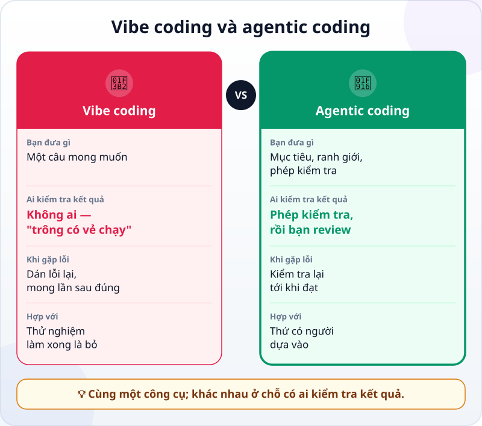

🌐 **Tiếng Việt** · [English](../../en/lessons/vibe-vs-agentic.md) · [日本語](../../ja/lessons/vibe-vs-agentic.md)

# Vibe coding và agentic coding: khác nhau ở đâu?

<!-- section: objective -->
## Mục tiêu bài học

Sau bài này, bạn sẽ:

- Phân biệt được **vibe coding** (nhận code mà không đọc, không kiểm tra) với **agentic coding** (mục tiêu, ranh giới, phép kiểm tra, review).
- Dùng được một câu hỏi đơn giản để chọn cách làm: *"Nếu nó sai mà không ai biết, ai bị thiệt?"*
- Biến một yêu cầu kiểu vibe thành yêu cầu kiểu agentic bằng cách thêm bốn thứ.

<!-- section: hook -->
## Mở đầu: vì sao nên quan tâm?

Huy là sinh viên năm hai. Một buổi tối, cậu gõ vào công cụ AI: *"Làm cho mình một trang web chia tiền khi cả nhóm đi ăn."* Mười phút sau đã có trang. Huy thử một lần: 300.000 đồng chia 3 người, mỗi người 100.000. Đúng. Cậu gửi link cho câu lạc bộ.

Cuối tháng, thủ quỹ câu lạc bộ cộng lại và thấy thiếu tiền: mỗi hóa đơn hụt một, hai nghìn đồng, cả tháng hụt vài chục nghìn. Huy không biết vì sao — cậu chưa từng đọc code, cũng chưa từng thử một hóa đơn nào ngoài lần đầu tiên.

Huy đã **vibe coding**. Cách đó không sai trong mọi trường hợp. Nhưng lần này có người dựa vào kết quả.

<!-- section: concept -->
## Nội dung chính

### Vibe coding là gì?

Theo trang giới thiệu của Google Cloud, cụm từ *vibe coding* do nhà nghiên cứu AI Andrej Karpathy đặt ra đầu năm 2025. Ở dạng "thuần" nhất, người dùng tin hoàn toàn vào code AI viết — gần như *quên rằng code tồn tại* — và nó hợp với những dự án cuối tuần làm xong là bỏ.

Trong thực tế, vibe coding thường trông như vầy:

1. Mô tả điều mình muốn bằng một câu.
2. Nhận code AI trả về, **không đọc**.
3. Chạy thử một lần. Có vẻ được thì giữ.
4. Có lỗi thì dán thông báo lỗi lại cho AI, và mong lần sau nó đúng.

Không có bước nào hỏi *"kết quả có đúng không?"* — chỉ hỏi *"nó có chạy không?"*.

### Agentic coding thêm bốn thứ

[Agentic coding](traditional-vs-agentic.md) có thể dùng **đúng cùng một công cụ**. Khác biệt nằm ở cách bạn làm việc với nó. Bạn thêm bốn thứ:

- **Mục tiêu rõ:** việc gì, cho ai, thế nào là xong — như trong [Viết yêu cầu tốt](writing-good-specs.md).
- **Ranh giới:** agent được đụng vào đâu, không được làm gì — ví dụ chỉ trong thư mục `ai-practice`, chỉ dữ liệu giả.
- **Một phép kiểm tra:** thứ cho ra *đạt / không đạt* mà agent tự chạy được, như một [bài test](testing-basics.md) hay một con số phải khớp.
- **Review:** bạn đọc thay đổi và bằng chứng trước khi nhận — như trong [Đọc và review thay đổi của agent](reviewing-agent-changes.md).



Để ý hàng giữa: **ai kiểm tra kết quả**. Trong vibe coding, câu trả lời là "không ai cả" — chỉ có cảm giác *trông có vẻ chạy*. Trong agentic coding, một phép kiểm tra chạy mỗi lần, và bạn đọc bằng chứng.

### Khi nào vibe coding là đủ?

Vibe coding không phải thứ xấu. Nó nhanh, vui, và rất hợp để thử một ý tưởng. Hỏi mình một câu: **"Nếu nó sai mà không ai biết, ai bị thiệt?"**

- **Không ai cả** — một trò chơi nhỏ để thử, một trang tập làm trong `ai-practice`, dữ liệu giả, làm xong là bỏ: vibe coding thoải mái. ✅
- **Có người** — tiền của người khác, dữ liệu của người khác, thứ người khác sẽ dùng hay mở lại tuần sau: cần agentic coding.

Trang của Huy rơi vào loại thứ hai ngay khi cậu gửi link cho câu lạc bộ. Từ lúc đó, nó không còn là thử nghiệm.

### Từ vibe sang agentic không tốn nhiều

Chuyển từ vibe sang agentic thường chỉ tốn thêm vài phút viết yêu cầu và vài phút đọc kết quả. Thứ tốn kém là **không** làm: lỗi âm thầm sống trong thứ mọi người đang dùng, và không ai biết nó ở đâu.

<!-- section: analogy -->
## Ví dụ đời thường

Nấu ăn cho mình và nấu cho quán. Buổi tối ở nhà, bạn nêm nếm theo cảm hứng: thêm chút nước mắm, chút đường, ăn được là được. Nấu cho quán thì khác: có công thức, có cân đo, có nếm thử trước khi mang ra, có giữ vệ sinh — vì khách trả tiền và tin bạn.

Cùng một cái bếp, cùng một người nấu. Khác nhau ở chỗ **ai ăn** món đó.

Phép so sánh sai ở chỗ: món ăn dở thì nếm là biết ngay. Code sai thì thường vẫn chạy, vẫn ra con số trông hợp lý — lỗi chỉ lộ ra khi có người cộng lại, như thủ quỹ của Huy. Vì vậy phép kiểm tra trong agentic coding phải được viết ra, không chỉ "nếm thử một lần".

<!-- section: example -->
## Ví dụ thực tế

Huy làm lại trang chia tiền, lần này theo kiểu agentic, trong thư mục `ai-practice`.

**Lần đầu (vibe):**

```text
Làm cho mình một trang web chia tiền khi cả nhóm đi ăn.
```

**Lần hai (agentic):**

```text
Mục tiêu: trang chia_tien.html chia một hóa đơn cho nhiều người, để câu lạc bộ dùng.
Ranh giới: chỉ làm trong thư mục ai-practice, một file, không gửi dữ liệu đi đâu.
Xong khi:
1. Số tiền hóa đơn nhập vào luôn là số chẵn nghìn đồng; số khác thì báo lỗi.
2. Mỗi phần là số chẵn nghìn đồng, và tổng các phần luôn bằng đúng số tiền hóa đơn.
3. Thử được với: 300.000 chia 3; 1.000.000 chia 3; 100.000 chia 7; 250.000 chia 1.
4. Nhập 0 người thì báo lỗi dễ hiểu, không hiện số lạ.
Viết một phép kiểm tra chạy tất cả các trường hợp trên, chạy nó và cho mình xem kết quả.
```

Agent viết trang, rồi chạy phép kiểm tra. Trường hợp **1.000.000 chia 3** không đạt: mỗi người 333.000, tổng 999.000 — hụt 1.000 đồng. Trường hợp **100.000 chia 7** cũng hụt: 7 × 14.000 = 98.000. Đó chính là lỗi đã làm quỹ câu lạc bộ thiếu tiền: mỗi phần bị làm tròn xuống tới nghìn, và phần lẻ biến mất.

Agent sửa: chia đều phần chẵn nghìn, rồi phần dư còn lại cộng thêm 1.000 đồng cho lần lượt vài người đầu tiên — 1.000.000 chia 3 thành 334.000, 333.000, 333.000. Chạy lại: mọi trường hợp đạt.

Huy không dừng ở đó. Cậu đọc báo cáo của agent, rồi tự thử một hóa đơn không có trong danh sách — 470.000 chia 6 — và cộng các phần bằng máy tính: 79.000 + 79.000 + 4 × 78.000 = 470.000. Khớp. Lúc đó cậu mới gửi link mới cho câu lạc bộ.

Cùng một công cụ, cùng một buổi tối. Lần hai tốn thêm khoảng mười phút.

<!-- section: misconceptions -->
## Hiểu lầm thường gặp

- **"Vibe coding lúc nào cũng xấu."** — Với thử nghiệm vứt đi, dữ liệu giả, không ai dựa vào, nó là cách nhanh để thử ý tưởng. Vấn đề chỉ đến khi thứ làm kiểu vibe bị đem ra dùng thật.
- **"Dùng agent là agentic, dùng chatbot là vibe."** — Không phụ thuộc công cụ. Bạn có thể vibe coding bằng một agent mạnh, nếu bạn không đưa phép kiểm tra và không đọc kết quả.
- **"Code chạy được, không báo lỗi, tức là đúng."** — Trang của Huy chạy trơn tru suốt một tháng mà vẫn sai. Chạy được khác với làm đúng việc.

<!-- section: recap -->
## Tóm tắt bằng hình


<!-- section: takeaways -->
## Ghi nhớ

- Vibe coding: mô tả, nhận code không đọc, thấy có vẻ chạy là giữ.
- Agentic coding thêm bốn thứ: mục tiêu rõ, ranh giới, một phép kiểm tra, review.
- Khác biệt nằm ở cách làm, không ở công cụ.
- Hỏi: "Nếu nó sai mà không ai biết, ai bị thiệt?" — không ai thì vibe thoải mái; có người thì cần agentic.
- Chạy được chưa chắc đúng: lỗi âm thầm chỉ lộ ra khi có phép kiểm tra hoặc có người cộng lại.

<!-- section: quiz -->
## Tự kiểm tra

**Câu 1.** Điều gì cho thấy rõ nhất một người đang vibe coding?

- A) Họ dùng một công cụ AI để viết code
- B) Họ giữ code vì nó có vẻ chạy, mà không đọc và không kiểm tra kết quả
- C) Họ viết yêu cầu bằng tiếng Việt thay vì tiếng Anh

**Câu 2.** Trường hợp nào vibe coding là đủ?

- A) Bảng tính lương mà cả phòng kế toán sẽ dùng
- B) Trang thu tiền quỹ lớp gửi cho cả lớp
- C) Một trò chơi nhỏ tự làm trong `ai-practice` để thử, làm xong là bỏ

**Câu 3.** Để biến yêu cầu *"làm trang chia tiền"* thành yêu cầu kiểu agentic, thêm gì là quan trọng nhất?

- A) Một phép kiểm tra agent tự chạy được, như "tổng các phần luôn bằng hóa đơn"
- B) Nhiều từ lịch sự hơn trong yêu cầu
- C) Yêu cầu agent làm nhanh hơn

<details>
<summary>Xem đáp án</summary>

1. **B** — dùng AI không phải là vibe; bỏ qua bước đọc và kiểm tra mới là vibe.
2. **C** — không ai dựa vào kết quả, nên nếu sai cũng không ai bị thiệt.
3. **A** — phép kiểm tra cho agent biết thế nào là đúng, và bắt được lỗi hụt tiền mà một lần thử không thấy.

</details>

<!-- section: sources -->
## Nguồn tham khảo

- Google Cloud — [What is vibe coding?](https://cloud.google.com/discover/what-is-vibe-coding) (tiếng Anh, cập nhật 3/2026): cụm từ do Andrej Karpathy đặt ra đầu năm 2025; vibe coding "thuần" là tin hoàn toàn vào code AI viết, hợp với dự án cuối tuần làm xong là bỏ; cách làm có trách nhiệm là người dùng đọc, test và hiểu code, và chịu trách nhiệm về sản phẩm.
- Anthropic — [Best practices for Claude Code](https://code.claude.com/docs/en/best-practices) (tiếng Anh, tính đến 9/2026): hãy cho agent một phép kiểm tra nó tự chạy được; không có nó, "trông như xong" là tín hiệu duy nhất.
