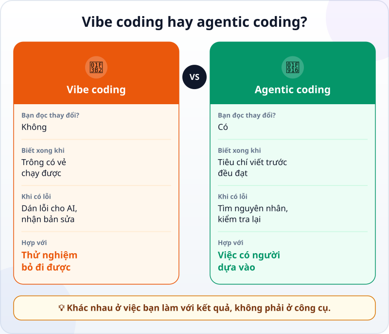
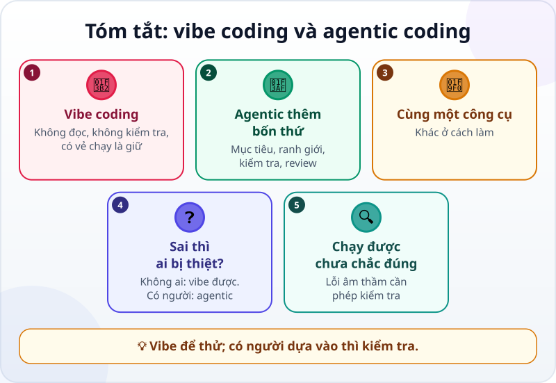

🌐 **Tiếng Việt** · [English](../../en/lessons/vibe-vs-agentic.md) · [日本語](../../ja/lessons/vibe-vs-agentic.md)

# Vibe coding và agentic coding: khác nhau ở đâu?

<!-- section: objective -->
## Mục tiêu bài học

Sau bài này, bạn sẽ:

- Phân biệt được **vibe coding** và **agentic coding** bằng việc bạn làm với kết quả, không phải bằng công cụ.
- Biết khi nào vibe coding là đủ, và dùng một câu hỏi để quyết định khi nào phải chuyển sang agentic.
- Nâng một yêu cầu kiểu vibe lên kiểu agentic bằng ba bước: tiêu chí xong, phép kiểm tra, bước duyệt.

<!-- section: hook -->
## Mở đầu: vì sao nên quan tâm?

Huy là sinh viên năm hai. Tối thứ Sáu, cậu làm cho câu lạc bộ một trang chấm điểm trò chơi đố vui chỉ bằng cách gõ mong muốn cho AI: *"thêm nút cộng điểm"*, *"cho màu đẹp hơn"*, *"thêm tên đội"*. Mỗi lần AI trả về, cậu mở trang, thấy chạy, rồi gõ yêu cầu tiếp. Không đọc dòng code nào. Một tiếng là xong, trông rất ổn.

Chủ nhật, câu lạc bộ dùng trang đó để chấm điểm thật. Giữa trận, bạn cầm máy lỡ bấm tải lại trang — toàn bộ điểm biến mất. Không ai biết điểm trước đó là bao nhiêu. Huy không làm sai công cụ nào; cậu chỉ đã dùng một cách làm hợp với trò chơi thử cho một việc có người dựa vào.

<!-- section: concept -->
## Nội dung chính

### Vibe coding là gì?

Theo Google Cloud, thuật ngữ **vibe coding** được nhà nghiên cứu AI Andrej Karpathy đặt ra vào đầu năm 2025. Ở dạng "thuần" nhất, bạn tin hoàn toàn vào kết quả AI trả về — như Karpathy nói, gần như "quên rằng code tồn tại". Cách làm quen thuộc: mô tả điều mình muốn, nhận code, thấy có vẻ chạy thì đi tiếp; gặp lỗi thì dán lỗi cho AI và nhận bản sửa, vẫn không đọc.

### Agentic coding khác ở đâu?

Agentic coding cũng giao phần viết code cho AI, như bạn đã thấy trong [Lập trình truyền thống và agentic coding](traditional-vs-agentic.md). Khác biệt nằm ở những gì bạn làm quanh việc đó: nói rõ mục tiêu và ranh giới, đưa một phép kiểm tra, duyệt thay đổi và bằng chứng, rồi chịu trách nhiệm về kết quả. Google Cloud gọi đây là phát triển có AI hỗ trợ một cách có trách nhiệm: người dùng dẫn dắt AI, nhưng rồi đọc lại, kiểm tra và hiểu code nó tạo ra.



Chú ý: **cùng một công cụ** có thể dùng theo cả hai cách. Dùng agent không tự động biến việc bạn làm thành agentic coding; bỏ qua kiểm tra thì vẫn là vibe.

### Khi nào vibe coding là đủ?

Vibe coding không xấu. Karpathy nói nó hợp với những "dự án cuối tuần để rồi bỏ đi" — khi tốc độ là điều quan trọng nhất. Trong khóa học này, nghĩa là:

- làm trong thư mục `ai-practice`, với dữ liệu giả;
- không ai khác dựa vào kết quả;
- xóa đi cũng không tiếc.

Ví dụ: thử xem một ý tưởng trò chơi trông thế nào, thử một kiểu trang trí cho trang cá nhân nháp.

### Một câu hỏi để quyết định

Trước khi dùng kết quả, hãy hỏi: **"Nếu cái này sai, ai chịu thiệt?"** Nếu câu trả lời là "không ai, tôi chỉ đang thử", vibe coding ổn. Nếu là một người khác, số liệu thật, tiền, hay một buổi sự kiện của câu lạc bộ — hãy chuyển sang agentic.

### Ba bước nâng từ vibe lên agentic

1. **Viết ra thế nào là xong** — như trong [Viết yêu cầu tốt](writing-good-specs.md).
2. **Thêm một phép kiểm tra** agent chạy được và bạn tự làm lại được — như trong [Từ "trông có vẻ đúng" đến phép kiểm tra](testing-basics.md).
3. **Duyệt thay đổi và bằng chứng** trước khi dùng — không chỉ nhìn giao diện.

<!-- section: analogy -->
## Ví dụ đời thường

Nấu ăn cho mình ăn thử và nấu cho cỗ cưới. Nấu thử một món mới cho mình, bạn nêm theo cảm hứng, dở thì thôi, mai nấu lại. Nấu cho năm mươi khách, bạn theo công thức, nếm ở từng bước, hỏi trước ai dị ứng món gì — vì có người khác dựa vào bữa ăn đó.

Phép so sánh sai ở chỗ: món dở thì nếm là biết ngay. Code sai thì thường trông vẫn ổn, và chỉ lộ ra đúng lúc có người dùng thật — như lúc bấm tải lại trang giữa trận đấu. Vì vậy với code, "nếm" nghĩa là chủ động kiểm tra, không phải chờ lỗi tự hiện ra.

<!-- section: example -->
## Ví dụ thực tế

Sau chủ nhật đó, Huy làm lại trang chấm điểm, lần này theo cách agentic, vẫn với cùng một agent.

**Yêu cầu kiểu vibe (lần trước):**

```text
Làm trang chấm điểm đố vui cho câu lạc bộ, có tên đội và nút cộng điểm, màu đẹp.
```

**Yêu cầu kiểu agentic (lần này):**

```text
Mục tiêu: trang chấm điểm đố vui cho 4 đội, dùng trong buổi sinh hoạt câu lạc bộ.
Ràng buộc: một file cham_diem.html trong ai-practice; không cài thêm gì khi chưa hỏi mình.
Xong khi:
1. Mỗi đội có nút +10 và -10; điểm không xuống dưới 0.
2. Tải lại trang, điểm vẫn còn.
3. Có nút "Ván mới" đưa điểm về 0, và hỏi lại trước khi xóa.
Làm xong, cho mình biết bạn đã kiểm tra từng điều thế nào.
```

Agent làm xong và báo cách đã kiểm tra. Huy không dừng ở lời báo cáo. Cậu đọc phần thay đổi, rồi tự thử cả ba điều: bấm -10 khi đội đang 0 điểm (vẫn 0), cộng vài lần rồi tải lại trang (điểm còn), bấm "Ván mới" (trang hỏi lại trước khi xóa; bấm đồng ý thì cả bốn đội về 0). Bằng chứng cậu ghi lại:

- *Tôi cho xem được…* file `cham_diem.html` chạy trên máy, điểm còn sau khi tải lại.
- *Tôi đã kiểm tra…* cả ba tiêu chí, tự tay, sau khi đọc phần thay đổi.
- *Tôi sẽ không dùng cách này khi…* nhiều người chấm điểm cùng lúc trên nhiều máy — trang này chỉ lưu điểm trên một trình duyệt.

Lần này mất lâu hơn khoảng mười lăm phút. Đổi lại, chủ nhật sau không ai phải nhớ điểm trong đầu.

<!-- section: misconceptions -->
## Hiểu lầm thường gặp

- **"Vibe coding là cách làm sai."** — Với thử nghiệm bỏ đi được, nó nhanh và vui. Nó chỉ sai chỗ khi có người dựa vào kết quả.
- **"Cứ dùng agent là agentic coding."** — Công cụ không quyết định điều đó. Không có tiêu chí, kiểm tra và duyệt thì vẫn là vibe, dù công cụ mạnh đến đâu.
- **"Trang chạy được là xong."** — Chạy được chỉ nghĩa là nó không báo lỗi khi bạn thử đúng một cách. Tiêu chí viết ra trước mới cho biết nó có làm đúng việc không.

<!-- section: recap -->
## Tóm tắt bằng hình



<!-- section: takeaways -->
## Ghi nhớ

- Vibe coding: nhờ AI viết, thấy chạy là nhận, không đọc, không kiểm tra.
- Agentic coding: mục tiêu, ranh giới, phép kiểm tra, duyệt — và bạn chịu trách nhiệm.
- Khác nhau ở việc bạn làm với kết quả, không phải ở công cụ.
- Vibe coding ổn cho thử nghiệm trong `ai-practice`, dữ liệu giả, bỏ đi được.
- Hỏi "Nếu sai, ai chịu thiệt?" — có người khác thì chuyển sang agentic.

<!-- section: quiz -->
## Tự kiểm tra

**Câu 1.** Điều gì phân biệt vibe coding với agentic coding?

- A) Vibe coding dùng chatbot, agentic coding dùng agent
- B) Vibe coding nhanh hơn nên luôn kém chất lượng hơn
- C) Việc bạn làm với kết quả: có tiêu chí, kiểm tra và duyệt hay không

**Câu 2.** Việc nào hợp với vibe coding nhất?

- A) Thử xem một ý tưởng trò chơi trông thế nào, trong `ai-practice`, rồi xóa đi
- B) Bảng tính lương của phòng kế toán
- C) Trang đăng ký cho sự kiện 200 người của câu lạc bộ

**Câu 3.** Trang AI làm cho bạn chạy tốt khi bạn thử. Tuần sau cả nhóm sẽ dùng nó. Bạn nên làm gì trước?

- A) Dùng luôn, vì bạn đã thử và thấy chạy
- B) Viết tiêu chí xong, kiểm tra từng tiêu chí và đọc phần thay đổi trước khi đưa cho nhóm
- C) Nhờ AI viết lại toàn bộ cho chắc

<details>
<summary>Xem đáp án</summary>

1. **C** — cùng một công cụ có thể dùng theo cả hai cách; tốc độ cũng không quyết định chất lượng.
2. **A** — không ai dựa vào kết quả và xóa đi không tiếc; hai việc kia có người khác chịu thiệt nếu sai.
3. **B** — có người khác dựa vào kết quả, nên cần tiêu chí, kiểm tra và duyệt; viết lại toàn bộ chỉ tạo ra thêm code chưa kiểm tra.

</details>

<!-- section: sources -->
## Nguồn tham khảo

- Google Cloud — [What is vibe coding?](https://cloud.google.com/discover/what-is-vibe-coding) (tiếng Anh, xem ngày 29/9/2026): thuật ngữ do Andrej Karpathy đặt ra đầu năm 2025; vibe coding "thuần" là tin hoàn toàn vào kết quả, "quên rằng code tồn tại", hợp nhất với "dự án cuối tuần để rồi bỏ đi"; phát triển có AI hỗ trợ một cách có trách nhiệm là người dùng dẫn dắt AI, rồi đọc lại, kiểm tra và hiểu code, và chịu trách nhiệm về sản phẩm cuối.
