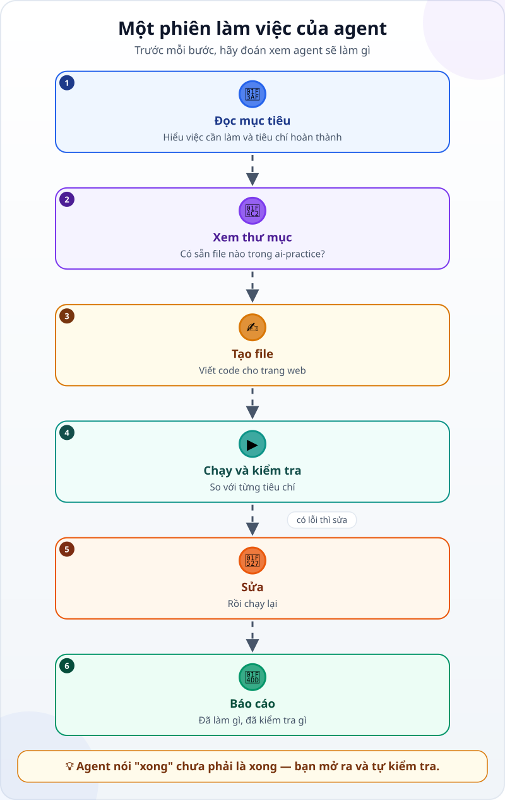
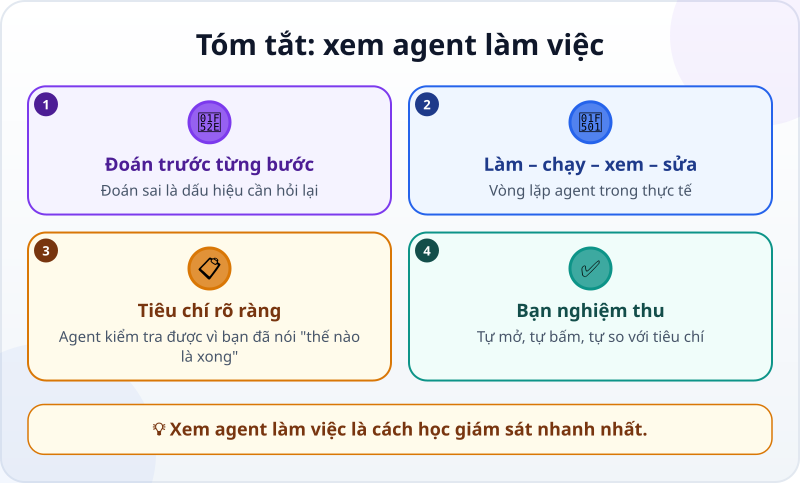

🌐 **Tiếng Việt** · [English](../../en/lessons/watch-an-agent-build.md) · [日本語](../../ja/lessons/watch-an-agent-build.md)

# Xem AI agent làm và tự kiểm tra một trang web nhỏ

<!-- section: objective -->
## Mục tiêu bài học

Sau bài này, bạn sẽ:

- Kể lại được các bước của một phiên làm việc của agent: đọc mục tiêu → xem thư mục → tạo file → chạy và kiểm tra → sửa → báo cáo.
- Biết cách **xem có chủ đích**: đoán trước bước tiếp theo, rồi so với việc agent thật sự làm.
- Hiểu vì sao agent báo "xong" chưa phải là xong, và tự nghiệm thu bằng tiêu chí của mình.

<!-- section: hook -->
## Mở đầu: vì sao nên quan tâm?

Bạn đã biết agent làm việc theo [vòng lặp suy nghĩ → hành động → quan sát](agent-parts-and-loop.md). Bài này cho bạn xem vòng lặp đó trong một việc thật: làm một trang web nhỏ.

Giống ngày đầu đi làm: bạn đứng cạnh một đồng nghiệp giỏi và xem họ làm một lần. Bạn chưa cần tự làm, nhưng bạn học được **thế nào là bình thường** — để sau này thấy ngay khi có gì đó không ổn.

<!-- section: concept -->
## Nội dung chính

### Một phiên làm việc, từng bước

1. **Đọc mục tiêu:** agent nhắc lại việc cần làm và tiêu chí hoàn thành. Nếu nó hiểu sai, đây là lúc rẻ nhất để chỉnh.
2. **Xem thư mục:** agent xem trong thư mục đã có gì trước khi viết, để không ghi đè file có sẵn.
3. **Tạo file:** agent viết code — những dòng lệnh cho máy tính — vào file.
4. **Chạy và kiểm tra:** agent mở thử thứ vừa làm và so với từng tiêu chí, nếu công cụ của nó cho phép mở trang và bấm thử.
5. **Sửa:** thấy lỗi thì sửa, rồi chạy lại. Bước 4 và 5 có thể lặp nhiều lần.
6. **Báo cáo:** agent kể lại đã làm gì, **đã kiểm tra gì — và chưa kiểm tra gì**.

### Xem có chủ đích: đoán trước, rồi so sánh

Đừng chỉ ngồi xem. Trước mỗi bước, hãy tự hỏi: *"Nếu là mình, bước tiếp theo sẽ là gì?"* Rồi so với việc agent làm:

- **Đoán đúng:** bạn đang hiểu cách agent làm việc.
- **Đoán sai:** hoặc bạn học được một cách làm mới, hoặc agent đang đi lạc — đó là lúc nên hỏi lại.

### Bốn điều nên để ý

- Agent có **xem trước khi viết** không?
- Nó có **chạy thử** thứ nó làm ra không?
- Nó có **so với tiêu chí** của bạn, hay chỉ thấy "có vẻ chạy được"?
- Báo cáo có nói rõ **điều gì chưa kiểm tra** không?

<!-- section: example -->
## Ví dụ thực tế

Hana làm văn phòng ở Tokyo và mới bắt đầu dùng AI. Cô muốn một trang web nhỏ hiện một mẹo làm việc mỗi lần mở, và giao cho agent trong thư mục thực hành `ai-practice`:

> *"Tạo một file `tips.html` hiện một mẹo làm việc, có nút 'Mẹo khác' để đổi mẹo. Xong khi: (1) mở được bằng trình duyệt, chỉ một file; (2) có 5 mẹo, bấm nút thì đổi sang mẹo khác; (3) chữ đủ to để đọc trên điện thoại."*

Phiên làm việc diễn ra như sau (rút gọn):

1. 🎯 Agent nhắc lại mục tiêu và 3 tiêu chí.
2. 📂 Xem `ai-practice`: chỉ có một file `README.txt`, không có gì bị ghi đè.
3. ✍️ Tạo `tips.html` với 5 mẹo và một nút bấm.
4. ▶️ Mở trang và bấm thử: **nút không đổi mẹo**. Thông báo lỗi cho biết nút gọi một đoạn code có tên không tồn tại — tên bị gõ sai một chữ.
5. 🔧 Sửa tên, mở lại: bấm nút thì mẹo đổi. Thu hẹp cửa sổ cho giống màn hình điện thoại: chữ vẫn đọc được.
6. 📝 Báo cáo: *"Đã tạo `tips.html`. Đã kiểm tra: mở được, có 5 mẹo, bấm nút thì mẹo đổi, chữ đọc được khi cửa sổ hẹp. Chưa kiểm tra trên điện thoại thật."*

Hana tự nghiệm thu theo 3 tiêu chí của mình. Cô bấm "Mẹo khác" liên tục — đến **lần bấm thứ 5**, ô mẹo **trống trơn**. Agent chỉ bấm thử vài lần nên chưa gặp lỗi này. Hana báo lại; agent sửa để sau mẹo cuối thì quay về mẹo đầu, rồi tự bấm hết một vòng để kiểm tra.

Điều Hana rút ra: agent chỉ kiểm tra được những gì nó **thấy**. Tiêu chí càng rõ — ví dụ *"bấm liên tục 10 lần vẫn luôn có mẹo"* — agent càng tự kiểm tra kỹ, và bước nghiệm thu cuối cùng vẫn là của bạn.

<!-- section: try-it -->
## Thử ngay

Không cần cài gì, khoảng 3 phút. Tuấn giao cho agent: *"Tạo trang `countdown.html` cho biết còn bao nhiêu ngày đến kỳ nghỉ hè (ngày 10/8). Xong khi: mở được bằng trình duyệt; con số khớp với lịch."* Agent đã làm:

1. Nhắc lại mục tiêu và 2 tiêu chí.
2. Xem thư mục `ai-practice`.
3. Tạo `countdown.html`.

**Bạn đoán:** bước tiếp theo agent nên làm gì? Và khi agent báo xong, Tuấn nên tự kiểm tra điều gì?

Gợi ý đáp án

- **Bước tiếp theo:** mở trang và so con số với lịch — ví dụ tính số ngày bằng một cách khác rồi so hai kết quả.
- **Tuấn tự kiểm tra:** mở file, tự đếm số ngày trên lịch và so với con số trên trang. Nếu trang đếm lệch một ngày, hay hiện số âm, đó là lỗi cần báo lại.

<!-- section: misconceptions -->
## Hiểu lầm thường gặp

- **"Agent báo xong là xong."** — Báo cáo cho biết agent đã kiểm tra gì. Đọc kỹ phần *chưa kiểm tra*, rồi tự nghiệm thu theo tiêu chí của bạn.
- **"Agent tự sửa được lỗi thì mình không cần xem."** — Nó sửa được lỗi nó thấy: lỗi gõ sai tên có thông báo lỗi rõ ràng. Lỗi chỉ lộ ra ở lần bấm thứ 5 thì phải có người — hoặc một tiêu chí rõ — mới tìm ra.
- **"Xem agent làm thì phí thời gian."** — Vài lần đầu, xem kỹ giúp bạn biết thế nào là bình thường. Về sau, bạn chỉ cần xem ở vài điểm quan trọng: mục tiêu, kết quả kiểm tra, báo cáo.

<!-- section: recap -->
## Tóm tắt bằng hình

<!-- section: takeaways -->
## Ghi nhớ

- Một phiên làm việc của agent: đọc mục tiêu → xem thư mục → tạo file → chạy và kiểm tra → sửa → báo cáo.
- Xem có chủ đích: đoán trước từng bước; đoán sai là dấu hiệu nên hỏi lại.
- Agent kiểm tra được vì bạn đã nói *thế nào là xong*; tiêu chí càng rõ, nó kiểm tra càng kỹ.
- Agent báo "xong" chưa phải là xong: bạn tự mở, tự bấm, tự so với tiêu chí.

<!-- section: quiz -->
## Tự kiểm tra

**Câu 1.** Vì sao agent nên xem thư mục trước khi tạo file?

- A) Để làm chậm lại cho cẩn thận
- B) Để biết đã có gì, tránh ghi đè file có sẵn
- C) Vì máy tính bắt buộc phải thế

**Câu 2.** Trong ví dụ, vì sao agent không tự phát hiện lỗi ô mẹo bị trống?

- A) Vì agent không biết đọc code
- B) Vì nó chỉ bấm thử vài lần, chưa đủ để lỗi lộ ra
- C) Vì Hana không cho agent bấm nút

**Câu 3.** Agent báo: *"Đã tạo file. Chưa kiểm tra trên điện thoại thật."* Bạn nên làm gì?

- A) Bỏ qua câu đó, vì agent đã báo xong
- B) Nếu điều đó quan trọng với bạn, tự kiểm tra phần còn thiếu hoặc giao agent kiểm tra thêm
- C) Xóa file và làm lại từ đầu

Xem đáp án

1. **B** — xem trước khi viết giúp agent không ghi đè thứ đang có.
2. **B** — agent chỉ kiểm tra được những gì nó thấy; tiêu chí "bấm liên tục vẫn luôn có mẹo" sẽ giúp nó tìm ra.
3. **B** — phần *chưa kiểm tra* trong báo cáo là việc của bạn: tự kiểm tra, hoặc giao thêm.

<!-- section: sources -->
## Nguồn tham khảo

- Anthropic — [Best practices for Claude Code](https://code.claude.com/docs/en/best-practices) (tiếng Anh): hãy cho agent một cách tự kiểm tra, như test hay ảnh chụp màn hình để so; không có nó, "trông có vẻ xong" là tín hiệu duy nhất, và bạn trở thành người phải tự phát hiện mọi lỗi.
- Anthropic — [Building Effective AI Agents](https://www.anthropic.com/engineering/building-effective-agents) (tiếng Anh, 12/2024): ở mỗi bước, agent cần lấy "sự thật" từ môi trường — kết quả dùng công cụ, kết quả chạy code — để biết mình đã tiến tới đâu.
