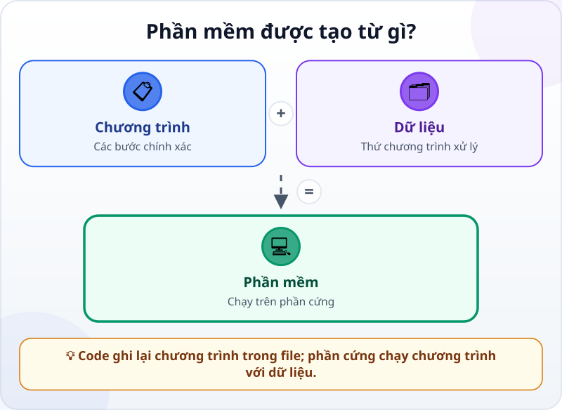
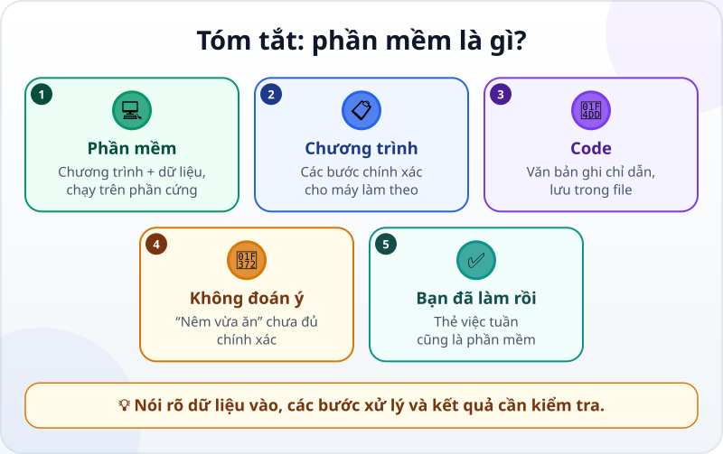

🌐 **Tiếng Việt** · [English](../../en/lessons/what-is-software.md) · [日本語](../../ja/lessons/what-is-software.md)

# Phần mềm là gì? Chương trình giống một công thức nấu ăn

<!-- section: objective -->
## Mục tiêu bài học

Sau bài này, bạn sẽ:

- Phân biệt được phần mềm, chương trình, code, dữ liệu và phần cứng ở mức cơ bản.
- Giải thích được vì sao máy tính cần các bước chính xác, không hiểu chỉ dẫn mơ hồ như con người.
- Nhận ra một sản phẩm nhỏ mình đã làm cũng là phần mềm.

<!-- section: hook -->
## Mở đầu: vì sao nên quan tâm?

Mai muốn nhờ máy tính chuẩn bị một danh sách việc. Cô nghĩ: “Việc này đơn giản, cứ bảo máy sắp xếp cho gọn là được.” Nhưng **gọn** nghĩa là gì: theo ngày, theo độ quan trọng, hay theo tên? Con người có thể đoán từ hoàn cảnh; máy tính thì cần một cách làm rõ ràng.

Đây là điều quan trọng khi Mai giao việc cho agent. Agent có thể viết rất nhiều code, nhưng nếu Mai không biết sản phẩm gồm những gì, cô khó nói chính xác mình muốn đổi gì và khó nhận ra agent đã đổi nhầm chỗ.

<!-- section: concept -->
## Nội dung chính

### Phần cứng chạy phần mềm

**Phần cứng** là phần vật lý: điện thoại, laptop, bộ nhớ và bộ xử lý. **Phần mềm** là các chương trình cùng dữ liệu mà phần cứng sử dụng. Ứng dụng lịch, bảng tính và trang web đều là phần mềm. Không có phần cứng, phần mềm không có máy để chạy; không có phần mềm, chiếc máy chưa biết phải làm việc gì.

**Dữ liệu** là những thứ chương trình làm việc cùng: tên việc, ngày, trạng thái hoàn thành, chữ trong tài liệu hay ảnh. Hai người có thể chạy cùng một chương trình nhưng thấy danh sách khác nhau vì dữ liệu của họ khác nhau.

### Chương trình là các bước chính xác

Một **chương trình** là tập hợp những chỉ dẫn từng bước mà máy tính có thể thực hiện. Ví dụ, chương trình cho thẻ việc có thể nhận danh sách, đặt việc chưa xong lên trước, rồi hiển thị từng việc trên màn hình.

Máy tính làm đúng những bước được mô tả, rất nhanh và lặp lại nhiều lần. Nhưng nó không tự dùng kinh nghiệm đời sống để lấp chỗ mơ hồ. “Sắp xếp hợp lý” chưa phải một quy tắc đủ chính xác. “Đặt việc chưa xong trước; trong mỗi nhóm, xếp ngày sớm trước” thì rõ hơn nhiều.

### Code là phần chữ của chương trình

**Code** là văn bản diễn tả các bước ấy bằng một ngôn ngữ lập trình. Code thường được giữ trong các **file** của dự án, để con người và agent có thể đọc, sửa và kiểm tra thay đổi. Khi chạy code, máy tính thực hiện chương trình và tạo ra kết quả trên màn hình hoặc trong file.

Bạn chưa cần học cách tự viết từng dòng code. Các khái niệm như biến, điều kiện, vòng lặp và hàm sẽ có trong [Biến, hàm, điều kiện, vòng lặp: 4 viên gạch thường gặp](programming-building-blocks.md). Ở đây, chỉ cần nhớ: chương trình là chỉ dẫn; code là phần chữ ghi lại chỉ dẫn đó.

<!-- section: analogy -->
## Ví dụ đời thường

Một chương trình giống **công thức nấu ăn**. Nguyên liệu giống dữ liệu; căn bếp và dụng cụ giống phần cứng; công thức ghi các bước giống code; món ăn hoàn thành giống kết quả.

Một đầu bếp hiểu câu “nêm vừa ăn” vì họ nếm, nhớ kinh nghiệm và điều chỉnh. Máy tính không biết “vừa” là bao nhiêu. Chỉ dẫn cho máy phải giống “thêm 2 gam muối, khuấy 10 giây” hơn là “nêm vừa ăn”. Mỗi đầu vào cần một bước xử lý rõ và một kết quả có thể kiểm tra.

Phép so sánh không hoàn toàn khớp: một đầu bếp có giác quan và có thể ứng biến, còn máy tính chỉ thực hiện cách xử lý đã được chương trình cho phép. Agent có thể giúp biến mong muốn của bạn thành code, nhưng sản phẩm cuối vẫn chạy theo code và dữ liệu, không theo ý định chưa nói ra.

<!-- section: example -->
## Ví dụ thực tế

Trong [Buổi đầu với agent: làm một trang “Việc của tôi trong tuần”](first-agent-session.md), Mai đã nhờ agent tạo một thẻ việc trong thư mục thực hành `ai-practice`. Đó không chỉ là “một trang đẹp”. Đó là phần mềm nhỏ mà cô đã làm:

1. **Dữ liệu** là các việc giả định như “Soạn bản nháp” và trạng thái đã xong hay chưa.
2. **Code** là phần chữ trong file mà agent tạo để mô tả nội dung, cách trình bày và hành vi.
3. **Chương trình** là các chỉ dẫn được trình duyệt thực hiện để biến code và dữ liệu thành thẻ việc.
4. **Phần cứng** là laptop đang chạy trình duyệt và hiển thị kết quả.

Khi Mai yêu cầu “đưa việc chưa xong lên đầu”, agent phải đổi chỉ dẫn trong code. Khi cô chỉ đổi “Soạn bản nháp” thành “Gửi bản nháp”, dữ liệu đổi nhưng cách chương trình hoạt động có thể giữ nguyên. Phân biệt hai loại thay đổi này giúp Mai mô tả việc rõ hơn.

<!-- section: misconceptions -->
## Hiểu lầm thường gặp

- **“Phần mềm chỉ là code.”** — Phần mềm còn cần dữ liệu để làm việc; và nó phải chạy trên phần cứng.
- **“Chương trình và code là hai thứ hoàn toàn khác nhau.”** — Chương trình là các chỉ dẫn; code là văn bản dùng để ghi những chỉ dẫn đó. Trong trò chuyện thường ngày, hai từ đôi khi được dùng gần nghĩa nhau.
- **“Máy tính sẽ hiểu ý mình.”** — Máy tính không tự hiểu “đẹp”, “hợp lý” hay “vừa ăn”. Hãy biến ý đó thành tiêu chí có thể quan sát và kiểm tra.
- **“Chỉ sản phẩm lớn mới gọi là phần mềm.”** — Một thẻ việc một file vẫn là phần mềm nếu có chỉ dẫn và dữ liệu được máy tính chạy.

<!-- section: recap -->
## Tóm tắt bằng hình

<!-- section: takeaways -->
## Ghi nhớ

- Phần mềm là chương trình cộng với dữ liệu, chạy trên phần cứng.
- Chương trình là các bước chính xác; máy tính không thể làm theo “nêm vừa ăn”.
- Code là văn bản của chương trình và thường được lưu trong file.
- Thẻ việc tuần trong `ai-practice` là phần mềm bạn đã làm.

<!-- section: quiz -->
## Tự kiểm tra

**Câu 1.** Mô tả nào đúng nhất về phần mềm?

- A) Chỉ những chiếc máy có màn hình
- B) Chương trình và dữ liệu chạy trên phần cứng
- C) Chỉ các ứng dụng lớn bán cho nhiều người

**Câu 2.** Vì sao “nêm vừa ăn” chưa phải chỉ dẫn tốt cho máy tính?

- A) Nó không cho biết một lượng và bước xử lý chính xác
- B) Máy tính không thể xử lý con số
- C) Mọi chương trình đều phải nói về nấu ăn

**Câu 3.** Code là gì?

- A) Phần vật lý bên trong laptop
- B) Mọi dữ liệu người dùng nhập
- C) Văn bản ghi các chỉ dẫn của chương trình

Xem đáp án

1. **B** — phần mềm gồm chương trình và dữ liệu, và cần phần cứng để chạy.
2. **A** — “vừa ăn” dựa vào phán đoán của người nấu, không phải một bước chính xác cho máy.
3. **C** — code là phần chữ mô tả các chỉ dẫn, thường được lưu trong file.

