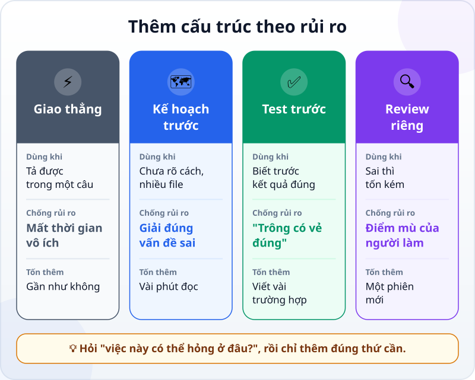
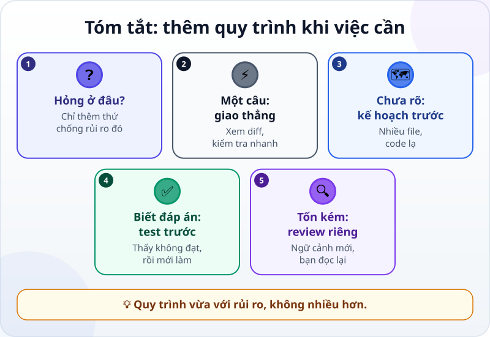

🌐 **Tiếng Việt** · [English](../../en/lessons/workflow-frameworks.md) · [日本語](../../ja/lessons/workflow-frameworks.md)

# Thêm quy trình khi việc cần: lập kế hoạch, viết test trước, duyệt lại

<!-- section: objective -->
## Mục tiêu bài học

Sau bài này, bạn sẽ:

- Chọn được giữa bốn cách: **giao thẳng**, **lập kế hoạch trước**, **viết test trước**, **review riêng** — theo rủi ro của việc.
- Biết mỗi cách chống lại rủi ro nào, và tốn thêm gì.
- Viết được một yêu cầu kiểu "test trước": các trường hợp có kết quả đúng biết trước, thấy test không đạt, rồi mới làm.

<!-- section: hook -->
## Mở đầu: vì sao nên quan tâm?

Hana đọc trên mạng về một "quy trình chuẩn" làm việc với AI: lúc nào cũng viết tài liệu yêu cầu, rồi kế hoạch, rồi test, rồi review, rồi mới làm. Cô thử áp dụng cho việc đổi màu tiêu đề thẻ công việc của mình. Mất bốn mươi phút, cho một thay đổi một dòng.

Tuần sau, cô làm ngược lại: giao thẳng một việc tính giờ làm thêm, không kế hoạch, không test. Kết quả chạy được — cho đến ngày có ca đêm.

Quy trình không phải càng nhiều càng tốt, cũng không phải càng ít càng nhanh. Nó nên **vừa với rủi ro** của việc.

<!-- section: concept -->
## Nội dung chính

### Bắt đầu từ câu hỏi: việc này có thể hỏng ở đâu?

Bạn đã có quy trình cơ bản [tìm hiểu → lập kế hoạch → thực hiện → kiểm chứng](explore-plan-build-verify.md). Bài này nói về chuyện **liều lượng**: thêm bao nhiêu cấu trúc cho một việc cụ thể. Mỗi thứ bạn thêm vào chống lại một rủi ro riêng.



### Giao thẳng

Hướng dẫn của Claude Code (9/2026) nói gọn: **nếu tả được thay đổi trong một câu, bỏ qua kế hoạch.** Đổi màu tiêu đề, sửa một lỗi chính tả, thêm một dòng vào danh sách. Giao, xem diff, mở ra nhìn một lần — xong.

### Lập kế hoạch trước — chống làm sai việc

Khi bạn chưa chắc nên làm theo cách nào, khi thay đổi đụng nhiều file, hoặc khi bạn chưa quen phần code đó, rủi ro lớn nhất là agent giải đúng một vấn đề **sai**. Một kế hoạch để bạn đọc trước tốn vài phút, và rẻ hơn nhiều so với sửa lại cả buổi làm sai hướng.

### Viết test trước — chống "trông có vẻ đúng"

Khi bạn **đã biết trước kết quả đúng** cho vài trường hợp — một lỗi cần tái hiện, những con số đã tính tay — hãy viết chúng thành [test](testing-basics.md) **trước khi** có code:

1. Viết các trường hợp và kết quả đúng.
2. Chạy test: nó phải **không đạt** (chưa có code, hoặc code cũ còn lỗi). Thấy nó không đạt là bằng chứng test thật sự kiểm tra được điều gì đó.
3. Rồi mới để agent làm, cho tới khi test đạt.

Hướng dẫn của Claude Code gợi ý đúng cách này khi sửa lỗi: viết một test không đạt để tái hiện lỗi, rồi mới sửa. Người làm phần mềm gọi nó là *phát triển hướng kiểm thử* (test-driven development, TDD).

### Review riêng — chống điểm mù của người làm

Người viết khó thấy lỗi của chính mình — agent cũng vậy, vì nó nhớ lý do nó đã làm mỗi bước. Khi sai thì tốn kém (tiền, dữ liệu, thứ nhiều người dùng), hoặc khi agent đã tự làm một mình lâu, hãy cho một lượt review **trong ngữ cảnh mới**: một phiên khác chỉ thấy diff và tiêu chí, không thấy lý lẽ đã dẫn tới nó. Rồi chính bạn đọc lại những gì phiên review tìm ra.

### Tên gọi thì nhiều, câu hỏi thì một

Trên mạng có rất nhiều "framework" với tên riêng, kèm mẫu tài liệu và các bước. Phần lớn là những cách ghép khác nhau của ba thứ trên. Bạn không cần sưu tầm chúng. Với mỗi việc, hỏi: **việc này có thể hỏng ở đâu?** — rồi chỉ thêm đúng thứ chống lại rủi ro đó. Thêm quá nhiều cũng có giá: chậm hơn, và ngữ cảnh đầy những tài liệu không ai cần.

<!-- section: analogy -->
## Ví dụ đời thường

Đi mua đồ. Ra tiệm tạp hóa đầu hẻm mua gói muối: cứ đi. Lần đầu đến một khu chợ lớn chưa quen: xem bản đồ trước — đó là **kế hoạch**. Đi chợ Tết cho cả nhà: viết danh sách trước khi đi, về nhà đối chiếu từng món — đó là **test trước**. Mua hàng bằng tiền quỹ công ty: một người khác kiểm lại hóa đơn — đó là **review riêng**.

Không ai viết danh sách để mua một gói muối, và không ai đi chợ Tết mà không có danh sách.

Phép so sánh sai ở chỗ: đi chợ chậm, nên thêm bước nào cũng thấy tốn. Agent làm rất nhanh, nên một kế hoạch hay một test thường chỉ tốn vài phút — rẻ hơn nhiều so với cảm giác của bạn. Đừng vì ngại mà bỏ qua bước việc thật sự cần.

<!-- section: example -->
## Ví dụ thực tế

Hana có ba việc trong tuần, tất cả trong `ai-practice` với dữ liệu giả.

**Việc 1 — đổi màu tiêu đề thẻ công việc.** Tả được trong một câu. **Giao thẳng**, đọc diff một dòng, mở trang xem. Hai phút.

**Việc 2 — tính giờ làm thêm từ bảng chấm công.** Hana đã biết trước kết quả đúng cho vài ngày, nên cô chọn **test trước**. Quy định giả: làm quá 8 tiếng một ngày thì tính là làm thêm, nghỉ trưa 1 tiếng không tính.

```text
Trước khi viết code, tạo file kiem_tra_lam_them.py với các trường hợp sau
(giờ vào, giờ ra, nghỉ 1 tiếng, làm quá 8 tiếng là làm thêm):
- 9:00 → 19:30: làm thêm 1,5 tiếng
- 8:30 → 17:30: làm thêm 0 tiếng
- 9:00 → 22:00: làm thêm 4 tiếng
- 22:00 → 7:00 hôm sau (ca đêm): làm thêm 0 tiếng
Chạy nó và cho mình xem nó KHÔNG ĐẠT (vì chưa có code). Chưa viết code tính toán.
```

Test không đạt, đúng như mong đợi. Hana nói tiếp: *"Giờ viết lam_them.py cho tới khi cả bốn trường hợp đạt."* Agent viết, chạy test: ba trường hợp đạt, **ca đêm** không đạt — code lấy 7:00 trừ 22:00 ra số âm. Agent sửa để hiểu giờ ra có thể sang ngày hôm sau, chạy lại: bốn trường hợp đều đạt. Đây chính là lỗi mà lần giao thẳng tuần trước đã bỏ lọt.

**Việc 3 — chia sẻ công cụ tính giờ cho cả nhóm.** Từ lúc này, sai thì nhiều người bị ảnh hưởng. Hana mở **một phiên mới** và yêu cầu **review riêng**: *"Đọc lam_them.py và kiem_tra_lam_them.py. So với quy định: làm quá 8 tiếng là làm thêm, nghỉ trưa 1 tiếng. Tìm trường hợp còn thiếu. Chưa sửa gì."* Phiên review chỉ ra một trường hợp chưa có test: gõ nhầm giờ ra 17:30 thành 7:30 với giờ vào 9:00, code hiểu thành ca đêm dài 22,5 tiếng và tính 13,5 tiếng làm thêm — không báo gì. Hana quyết định: ca dài quá 16 tiếng thì báo lỗi để người nhập xem lại. Cô thêm trường hợp đó vào test, để agent sửa tới khi đạt, rồi mới gửi cho nhóm.

Ba việc, ba liều lượng khác nhau. Không việc nào dùng "quy trình chuẩn" đầy đủ.

<!-- section: misconceptions -->
## Hiểu lầm thường gặp

- **"Làm với AI thì lúc nào cũng phải lập kế hoạch."** — Với thay đổi tả được trong một câu, kế hoạch chỉ làm chậm. Để dành nó cho việc chưa rõ cách làm hay đụng nhiều file.
- **"Test viết sau cũng như viết trước."** — Test viết sau dễ bị viết theo đúng code đã có, kể cả chỗ sai. Viết trước và thấy nó không đạt thì bạn biết nó thật sự kiểm tra được.
- **"Agent đã tự kiểm tra rồi thì không cần review riêng."** — Agent kiểm tra theo cách nó hiểu việc. Một phiên mới chỉ thấy diff và tiêu chí thường nhìn ra chỗ người làm bỏ sót.

<!-- section: recap -->
## Tóm tắt bằng hình



<!-- section: takeaways -->
## Ghi nhớ

- Hỏi trước: việc này có thể hỏng ở đâu? Rồi chỉ thêm thứ chống lại rủi ro đó.
- Tả được trong một câu: giao thẳng, xem diff, kiểm tra nhanh.
- Chưa rõ cách làm hay đụng nhiều file: lập kế hoạch trước.
- Biết trước kết quả đúng: viết test trước, thấy nó không đạt, rồi mới làm.
- Sai thì tốn kém: review riêng trong ngữ cảnh mới, rồi bạn đọc lại kết quả.

<!-- section: quiz -->
## Tự kiểm tra

**Câu 1.** Việc nào nên **giao thẳng**, không cần kế hoạch?

- A) Sửa lỗi chính tả trong tiêu đề trang
- B) Thêm tính năng xuất dữ liệu, đụng tới bốn file bạn chưa đọc bao giờ
- C) Viết lại cách tính lương cho cả phòng

**Câu 2.** Vì sao nên chạy test và thấy nó **không đạt** trước khi có code?

- A) Để agent quen với việc thất bại
- B) Để chắc rằng test thật sự kiểm tra được điều gì đó
- C) Vì công cụ bắt buộc phải thế

**Câu 3.** Hana sắp chia sẻ công cụ tính giờ cho cả nhóm. Vì sao cô mở một phiên **mới** để review?

- A) Vì phiên cũ đã hết pin
- B) Vì phiên mới sẽ sửa code nhanh hơn
- C) Vì phiên mới chỉ thấy diff và tiêu chí, không bị lý lẽ của lúc làm dẫn dắt, nên dễ thấy chỗ bỏ sót

<details>
<summary>Xem đáp án</summary>

1. **A** — tả được trong một câu; kế hoạch chỉ làm chậm.
2. **B** — một test chưa từng không đạt có thể không kiểm tra gì cả.
3. **C** — người làm, kể cả agent, dễ bỏ qua lỗi của chính mình; ngữ cảnh mới nhìn kết quả bằng con mắt khác.

</details>

<!-- section: sources -->
## Nguồn tham khảo

- Anthropic — [Best practices for Claude Code](https://code.claude.com/docs/en/best-practices) (tiếng Anh, tính đến 9/2026): lập kế hoạch có ích nhất khi chưa chắc cách làm, khi thay đổi đụng nhiều file hoặc khi chưa quen phần code; tả được diff trong một câu thì bỏ qua kế hoạch; khi sửa lỗi, viết một test không đạt để tái hiện lỗi rồi mới sửa; thêm một bước review trong ngữ cảnh mới, chỉ thấy diff và tiêu chí, trước khi coi việc là xong.
