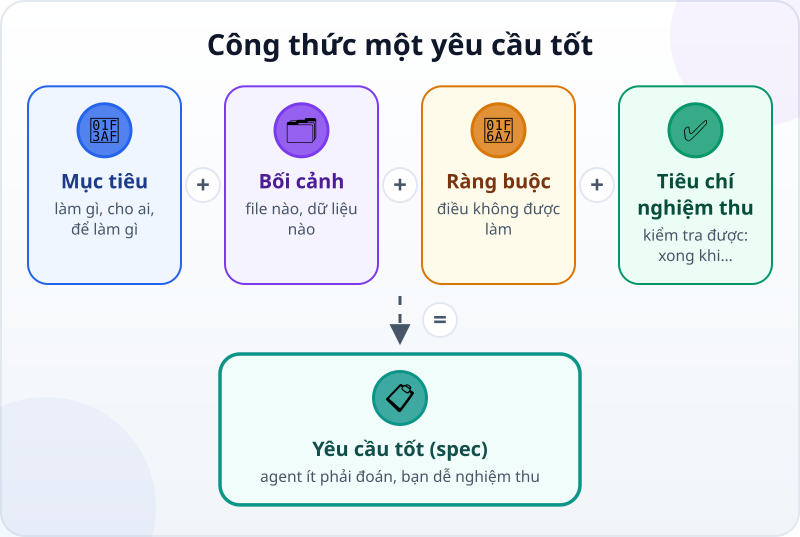
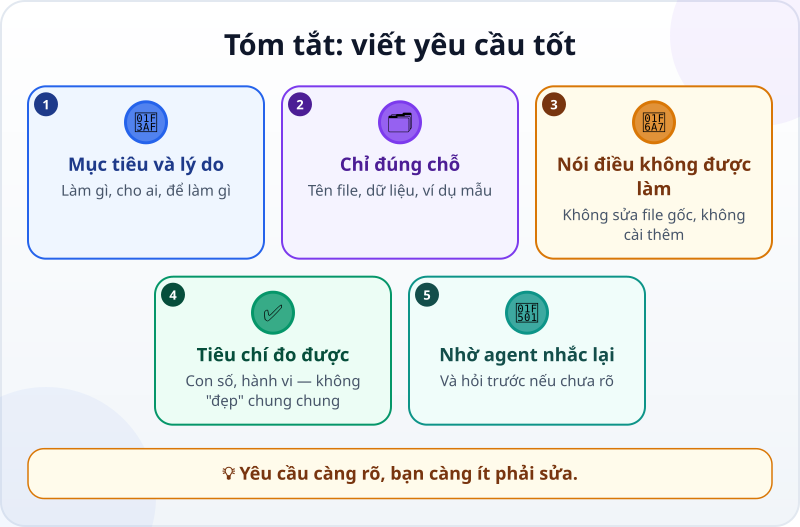

🌐 **Tiếng Việt** · [English](../../en/lessons/writing-good-specs.md) · [日本語](../../ja/lessons/writing-good-specs.md)

# Viết yêu cầu tốt: mô tả việc và tiêu chí hoàn thành

<!-- section: objective -->
## Mục tiêu bài học

Sau bài này, bạn sẽ:

- Viết được một yêu cầu (spec) gồm bốn phần: **mục tiêu**, **bối cảnh**, **ràng buộc** và **tiêu chí nghiệm thu**.
- Biến một tiêu chí mơ hồ ("đẹp", "nhanh", "đúng") thành tiêu chí kiểm tra được.
- Dùng spec đó để giao việc cho agent và tự nghiệm thu.

<!-- section: hook -->
## Mở đầu: vì sao nên quan tâm?

Bạn đã thấy: agent tự kiểm tra được đến đâu là tùy tiêu chí bạn đưa. Tài liệu hướng dẫn của Anthropic nói gọn: agent có thể đoán ý bạn, nhưng không đọc được suy nghĩ của bạn — yêu cầu càng chính xác, bạn càng ít phải sửa.

Bài này biến thói quen đó thành một công thức bạn dùng được cho mọi việc, từ trang web nhỏ đến báo cáo hàng tháng.

<!-- section: concept -->
## Nội dung chính

### Công thức bốn phần



- **Mục tiêu:** làm gì, cho ai, để làm gì. Biết lý do, agent chọn cách làm hợp hơn.
- **Bối cảnh:** file nào, dữ liệu nào, đã có gì. Gọi đúng tên file thay vì "cái file hôm trước".
- **Ràng buộc:** điều không được làm, và giới hạn: *không sửa file gốc*, *không cài thêm gì*, *chỉ làm trong `ai-practice`*.
- **Tiêu chí nghiệm thu:** những điều kiện cụ thể, kiểm tra được, bắt đầu bằng *"Xong khi…"*.

### Tiêu chí mơ hồ và tiêu chí kiểm tra được

Phép thử đơn giản: **một người khác đọc tiêu chí của bạn có tự kiểm tra được không, mà không cần hỏi lại?**

| Mơ hồ | Kiểm tra được |
|---|---|
| Trang đẹp | Đọc được trên điện thoại mà không phải phóng to |
| Chạy nhanh | Mở file 1.000 dòng xong trong 2 giây trên máy của mình |
| Tính đúng | Tổng của 3 dòng đầu khớp với tổng mình cộng tay |
| Dễ dùng | Một đồng nghiệp chưa thấy bao giờ tự làm được mà không cần hỏi |

### Nhờ agent nhắc lại và hỏi trước

Kết thúc mọi spec bằng một câu: *"Trước khi làm, nhắc lại mục tiêu và tiêu chí bằng lời của bạn. Có gì chưa rõ thì hỏi mình trước."* Hiểu lầm được phát hiện ở đây là rẻ nhất — trước khi agent làm cả buổi theo hướng sai.

<!-- section: try-it -->
## Thử ngay

Khoảng 12 phút, trong `ai-practice`, chỉ với dữ liệu giả.

Mai nhắn cho agent: *"Làm cho mình bảng tổng hợp chi phí tháng này."* Hãy viết lại thành một spec.

**1. Tạo dữ liệu giả (2 phút)** — giao cho agent:

```text
Tạo file chi_phi.csv gồm 20 dòng chi phí bịa trong tháng 9/2026,
với các cột: ngay, hang_muc, so_tien.
hang_muc chỉ gồm: Di lai, An uong, Van phong pham, Khac. so_tien tính bằng đồng.
```

Tên cột và hạng mục viết không dấu để file mở bằng Excel không bị lỗi hiển thị.

**2. Viết spec theo khung (5 phút):**

```text
Mục tiêu:
Bối cảnh:
Ràng buộc:
Xong khi:
1.
2.
3.
Trước khi làm, nhắc lại mục tiêu và tiêu chí. Có gì chưa rõ thì hỏi mình trước.
```

**3. So với bản mẫu** bên dưới — bản của bạn không cần giống hệt, chỉ cần đủ bốn phần và tiêu chí kiểm tra được.

**4. Giao việc và nghiệm thu (5 phút):** gửi spec cho agent, duyệt từng thay đổi, rồi tự kiểm tra từng tiêu chí. Ghi bằng chứng:

- *Tôi cho xem được…* file `tong_hop.csv` mở trong bảng tính.
- *Tôi đã kiểm tra…* tổng cộng khớp với tổng cột `so_tien`; hạng mục Di lai khớp với số tôi tự cộng.
- *Tôi sẽ không dùng cách này khi…* ví dụ: dữ liệu có nhiều loại tiền tệ khác nhau.

<details>
<summary>Spec mẫu</summary>

```text
Mục tiêu: tạo bảng tổng hợp chi phí tháng 9/2026 theo hạng mục, để gửi báo cáo cuối tháng.
Bối cảnh: dữ liệu ở chi_phi.csv trong thư mục này (cột ngay, hang_muc, so_tien). Dữ liệu là giả.
Ràng buộc: không sửa chi_phi.csv; ghi kết quả vào file mới tong_hop.csv;
cần cài thêm gì thì hỏi mình trước.
Xong khi:
1. tong_hop.csv có một dòng cho mỗi hạng mục (4 dòng) và một dòng Tong cong.
2. Tong cong bằng tổng cột so_tien trong chi_phi.csv.
3. Số tiền hạng mục Di lai khớp với số mình tự cộng.
Trước khi làm, nhắc lại mục tiêu và tiêu chí. Có gì chưa rõ thì hỏi mình trước.
```

</details>

<!-- section: misconceptions -->
## Hiểu lầm thường gặp

- **"Yêu cầu càng dài càng tốt."** — Không phải dài, mà đủ bốn phần. Vài gạch đầu dòng ngắn dễ kiểm tra hơn một đoạn văn dài.
- **"Tiêu chí để agent tự nghĩ."** — Agent có thể đề xuất, nhưng quyết định thế nào là xong là việc của bạn.
- **"Lúc nào cũng phải viết spec đầy đủ."** — Khi chỉ muốn khám phá ý tưởng (*"file này có thể cải thiện gì?"*), một câu hỏi mở vẫn có ích. Nhưng khi giao việc cần kết quả, hãy viết đủ bốn phần.
- **"Viết spec một lần là xong."** — Khi phát hiện điều mới (như lỗi chỉ hiện ra ở lần bấm thứ 5), thêm nó vào tiêu chí cho lần sau.

<!-- section: recap -->
## Tóm tắt bằng hình



<!-- section: takeaways -->
## Ghi nhớ

- Spec = **mục tiêu** + **bối cảnh** + **ràng buộc** + **tiêu chí nghiệm thu**.
- Tiêu chí tốt là tiêu chí người khác tự kiểm tra được: con số, hành vi, không phải "đẹp" hay "nhanh" chung chung.
- Kết thúc spec bằng: nhắc lại mục tiêu và tiêu chí, hỏi trước nếu chưa rõ.
- Học được điều mới khi nghiệm thu? Thêm nó vào tiêu chí.

<!-- section: quiz -->
## Tự kiểm tra

**Câu 1.** Tiêu chí nào kiểm tra được?

- A) "Tổng cộng bằng tổng cột `so_tien`."
- B) "Báo cáo trông chuyên nghiệp."
- C) "Agent làm cẩn thận."

**Câu 2.** Câu "không sửa file gốc" thuộc phần nào của spec?

- A) Mục tiêu
- B) Bối cảnh
- C) Ràng buộc

**Câu 3.** Vì sao nên nhờ agent nhắc lại mục tiêu trước khi làm?

- A) Để agent chạy nhanh hơn
- B) Để phát hiện hiểu lầm sớm, khi sửa còn rẻ
- C) Để buổi làm việc dài hơn

<details>
<summary>Xem đáp án</summary>

1. **A** — ai cũng tự so được hai con số; B và C là cảm nhận, không kiểm tra được.
2. **C** — ràng buộc là điều không được làm và các giới hạn.
3. **B** — sửa một câu nhắc lại rẻ hơn nhiều so với sửa cả buổi làm sai hướng.

</details>

<!-- section: sources -->
## Nguồn tham khảo

- Anthropic — [Best practices for Claude Code](https://code.claude.com/docs/en/best-practices) (tiếng Anh), mục *Provide specific context in your prompts*: yêu cầu càng chính xác thì càng ít phải sửa; hãy chỉ rõ file, nêu ràng buộc, và mô tả "đã sửa xong" trông như thế nào. Câu hỏi mơ hồ vẫn có ích khi bạn đang khám phá.
